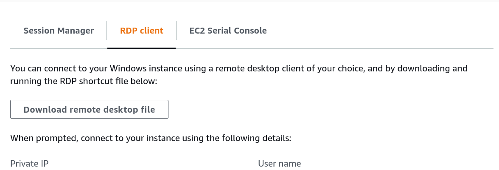
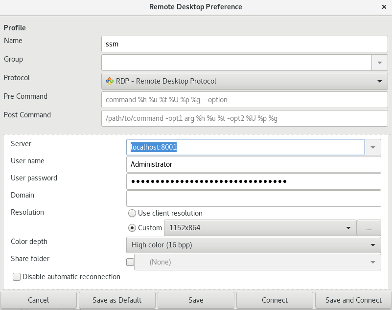

# RDP to Windows EC2 without a bastion host or public subnet

Let's assume we have a Windows EC2 instance running in private subnet, which means no access to public internet. In order to get the CLI access to the instance one can use Session Manager service by AWS Systems Manager (SSM). For this you can use IAM instance profile attached to the instance with AmazonSSMManagedInstanceCore managed policy. Having powershell access is great but there can be a situation where we need GUI access. This page is about connecting to Windows using RDP with Session Manager.

Prerequisite on local machine (Ubuntu focused):

* [AWS CLI](https://docs.aws.amazon.com/cli/latest/userguide/install-cliv2.html)
* [Session Manager plugin for AWS CLI](https://docs.aws.amazon.com/systems-manager/latest/userguide/session-manager-working-with-install-plugin.html)
* Hope you have opened up RDP port (3389) of EC2 instance via security group for your local machine

Assuming you have installed both the pre-requisites on your local machine, you can use port forwarding feature through Session Manager's AWS-StartPortForwardingSession document.

There are two parts for this to work - "Port Forwarding" and "Connection via RDP".

## 1. Port Forwarding

Use the below command to start the session -

```bash
    aws ssm start-session --target <instance-id> --document-name AWS-StartPortForwardingSession --parameters "localPortNumber=<chosen port number>,portNumber=3389" --profile <your profile name>
```

Here, `<chosen port number>` is the port number that you assign on your local machine. Best practice is to use ephemeral port between 1025 and 65535.

`--profile <your profile name>` is an optional argument which should be used if your AWS CLI is configured with named profile. You can export the profile as an environment variable if you have to use it in multiple commands (export AWS_PROFILE=user1)

Below is an example of the above command that I used in my terminal -

```bash
    aws ssm start-session --target i-034gh8bdcf34537fc --document-name AWS-StartPortForwardingSession --parameters "localPortNumber=8001,portNumber=3389"
```

If successful, you will see something like this -

```
    Starting session with SessionId: <session id name>

    Port 8001 opened for sessionId <session id name>.

    Waiting for connections...
```

Great! We have successfully forwarded the port from remote Windows machine to our local machine. Let's do the next part i.e connection via RDP

## 2. Connection via RDP

a. Open the RDP client installed on your local machine and enter the localhost:<your localPortNumber> as the server name

b. Give other information like username and decrypted password that you can get from the AWS when you connect your instance via the web console. Example -




For my ubuntu machine I use Remmina as the RDP client and below is the screenshot of how it looks like when I connect via RDP



Note: In my case the "Use client resolution" didn't work and I had to use the custom resolution to make it work. The above screenshot gives more idea.

Again, if everything worked well then you will get the below message in your terminal -

    Connection accepted for session <session id name>

Finally to close the connection, simple terminate the session in your terminal by pressing Ctrl+C
