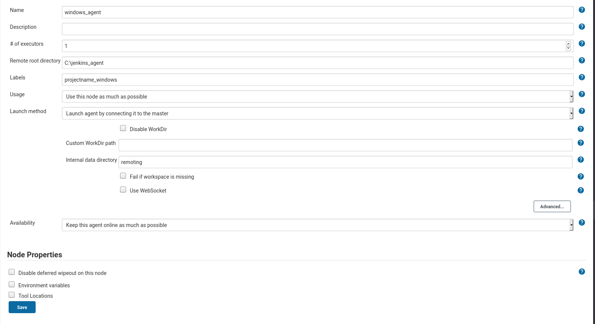
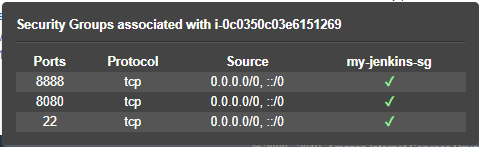

# Configure windows machine as jenkins agent

## 1. Jenkins Master
1. Add new node
2. Configure new node with below details



__Additional Check:__

Go to "Configure Global Security" -> "Manage Jenkins" and check if `TCP port for JNLP agents` is not disabled. If disabled, give it a fixed port e.g 8888. This will allow jnlp connection from agent to master.

As we have enabled `8888` for incoming agent connection through JNLP we need to expose the same port in security group of jenkins master in AWS.



> Once the node is created, it will remain offline with some instruction to connect the agent to master which is the next step.

## 2. Windows Agent machine

__Prerequisite:__

`choco install javaruntime` - The agent needs java jre installed.

`choco install nssm` - NSSM for creating service to relaunch agent after every reboot.

__Steps:__

1. Create folder
 `C:\jenkins_agent` (same name given to remote directory while creating node in master)
2. Download the agent.jar
```powershell
    Invoke-WebRequest -Uri "https://public_ip:port/jnlpJars/agent.jar" -OutFile "C:\jenkins_agent\agent.jar"

```
> We are using public_ip:port but one can use public_dns as well
3. create __NSSM__ service
```powershell
agent_secret="GIVEN_AGENT_SECRET" # e.g. "random hash"
agent_name="GIVEN_NAME" # e.g. "node_name"
agent_url="https://public_ip:port/computer/${agent_name}/slave-agent.jnlp"

echo "java -jar C:\jenkins_agent\agent.jar -jnlpUrl $agent_url -secret $agent_secret -workDir `"c:\jenkins_agent`"" | Out-File C:\jenkins_agent\scripts\service.bat -encoding ascii

nssm install <service_name e.g jenkins_agent> "C:\jenkins_agent\scripts\service.bat"
nssm set <service_name e.g jenkins_agent> AppStderr "C:\jenkins_agent\scripts\stderr.log"
nssm set <service_name e.g jenkins_agent> AppStdout "C:\jenkins_agent\scripts\stdout.log"
nssm start <service_name e.g jenkins_agent> SERVICE_AUTO_START
```

That should be it! Create a test pipeline to test.
