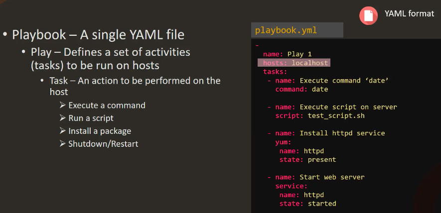
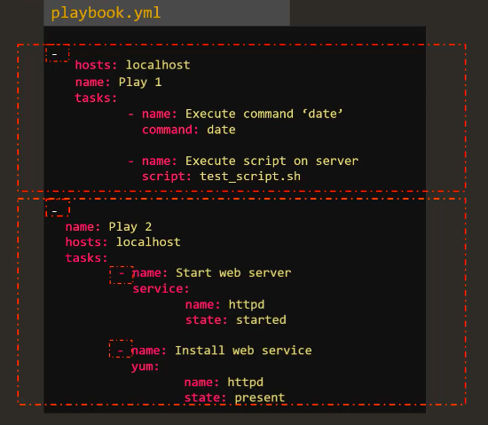
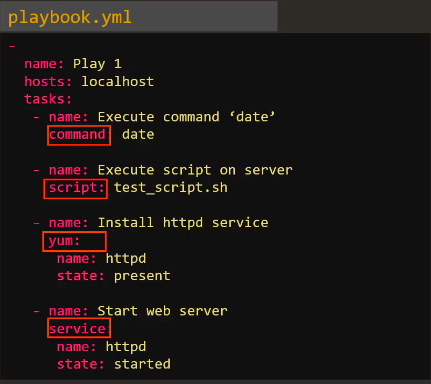
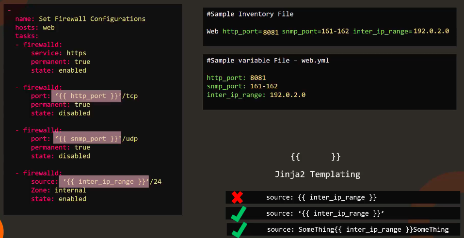
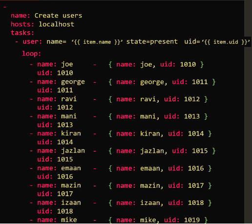
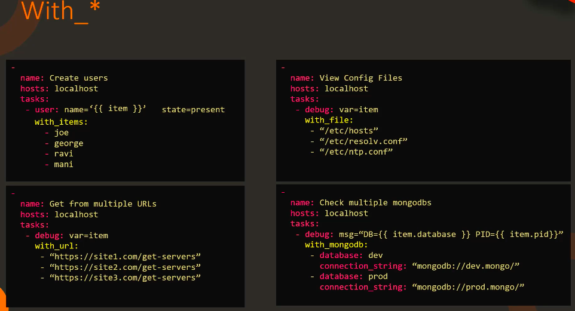
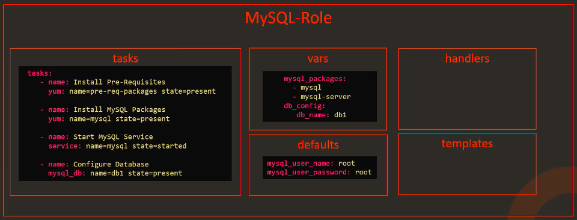
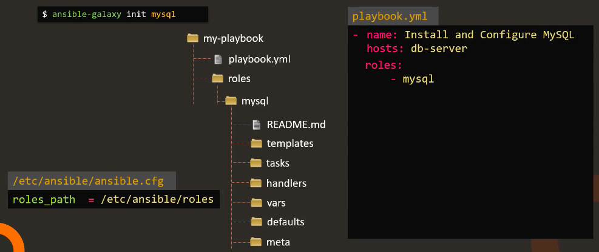
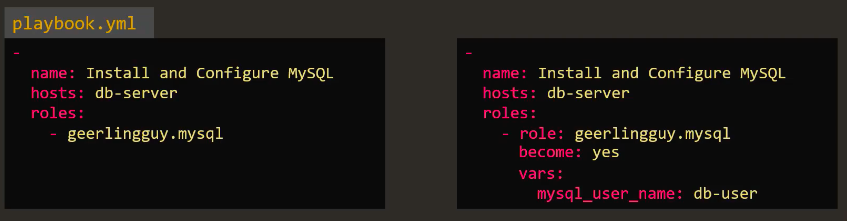

# Ansible Basics
- Check additional notes on ansible here as well - [../../work_notes](../../work_notes.md)

## <a id="inventory"></a> Inventory
- In order to work with multiple servers, ansible needs to make connectivity to those servers. It is done using __ssh on linux__ and __powershell remoting on windows__
- That's what makes ansible agentless - no need to install software on target machines to work with ansible
- Info about the hosts are stored in inventory file. We can create our own custom inventory file
- `/etc/ansible/hosts` default inventory file
- Below is an example of how inventory file can look like (inventory file looks like an INI file)
    ```ini
    # Sample Inventory File

    # Database servers
    sql_db1 ansible_host=sql01.xyz.com ansible_connection=ssh ansible_user=root ansible_ssh_pass=Lin$Pass
    sql_db2 ansible_host=sql02.xyz.com ansible_connection=ssh ansible_user=root ansible_ssh_pass=Lin$Pass

    # Web servers
    web_node1 ansible_host=web01.xyz.com ansible_connection=winrm ansible_user=administrator ansible_password=Win$Pass
    web_node2 ansible_host=web02.xyz.com ansible_connection=winrm ansible_user=administrator ansible_password=Win$Pass
    web_node3 ansible_host=web03.xyz.com ansible_connection=winrm ansible_user=administrator ansible_password=Win$Pass

    [db_nodes]
    sql_db1
    sql_db2

    [web_nodes]
    web_node1
    web_node2
    web_node3

    [boston_nodes]
    sql_db1
    web_node1

    [dallas_nodes]
    sql_db2
    web_node2
    web_node3

    [us_nodes:children]
    boston_nodes
    dallas_nodes
    ```

    - default port is 22 for ssh and 5986 for winrm
    - obviously storing password in inventory is not a good option in production environment so we can have ssh passwordless connection or more about it is discussed in ansible vault topic
------
## <a id="playbooks"></a> Playbooks
- It's ansible's orchestration language where we define what ansible should do

- Let's take another example of the same playbook file but in a slightly different format
> TO RECAP: In YAML, list is ordered (position matters) and dictionary is unordered
    ]
    - So here playbook is a list of plays and each play is a dictionary so the order in the dictionary doesn't matter meaning name, hosts and tasks can be in any order
    - But for tasks, order is important as items/value of `tasks` key is a list and thus as you can see in the above image I cannot "Start web server" and then "Install web service"

> `hosts` defined in the playbook must match the host/group created in the __inventory__

- `ansible-playbook <playbook.yml>` to execute a playbook
- `ansible-playbook --help` for help
-----
## <a id="modules"></a> Modules
- Different actions run by tasks are called modules
- There are hundreds of modules; common ones - command, script, yum, service
 
-----
## <a id="variables"></a> Variables
- Some of the ways we can define variables include
    - Example of variables in inventory file
    ```ansible
    web1 ansible_host=server1.company.com ansible_connection=ssh ansible_ssh_pass=P@ss
    ```
    > here ansible_host is an e.g of variable
    - Example of variables in playbook
    ```ansible
    -
        name: Add DNS server to resolv.conf
        hosts: localhost
        vars:
            dns_server: 10.1.250.10
        tasks:
            - lineinfile:
                path: /etc/resolv.conf
                line: 'nameserver {{ dns_server }}'
    ```
    - Example of variables in a separate variable file
    ```ansible
    variable1: value
    variable2: value
    ```
    
    - In the above image, we have used variables instead of hardcoded values in the playbook so that if someone else has to use the playbook they don't need to change the script
    - The variables are defined in the inventory file in option 1
    - The best would be to define the variables in a variable file __named by the host name__
    - That way others can only change the variable configuration and not the actual script/playbook
    > Note the variable uses __jinja2 templating__ format which needs to be in quote when used except when used in b/w strings
    - Example of using variables in playbook for arithmetic operation
    ```ansible
    -
    name: 'Am I an Adult or a Child?'
    hosts: localhost
    vars:
        age: 25
    tasks:
        -
            command: 'echo "I am a Child"'
            when: age < 18
        -
            command: 'echo "I am an Adult"'
            when: age >= 18
    ```
-----
## <a id="conditionals"></a> Conditionals
- Below is an example of conditional where we want to use `apt` module if the host is Debian and `yum` module if it is Redhat
```ansible
---
- name: Install NGINX
  hosts: all
  tasks:
    - name: Install NGINX on Debian
      apt:
        name: nginx
        state: present
      when: ansible_os_family == "Debian" and
            ansible_os_distribution == "16.04"
    - name: Install NGINX on Redhat
      yum:
        name: nginx
        state: present
      when: anisble_os_family == "RedHat" or
            ansible_os_family == "SUSE"
```
> here `ansible_os_*` is an ansible built-in variables

### Conditionals and Register
- __Register__ is used to record the output of a task
- In the below scenario, we have to write a playbook that checks the status of a service and emails us if it is down
```ansible
- name: Checks status of a service and email if its down
  hosts: localhost
  tasks:
    - command: service httpd status
      register: result
    
    - mail:
        to: admin@company.com
        subject: Service Down Alert
        body: Httpd Service is down
      when: result.stdout.find('down') != -1
```
## <a id="loops"></a>Loops


The above image shows two ways of creating a loop (items are dictionary)



Another way of creating loops is with `with_*` directive. For simple and normal use case, use the new syntax `loop`
    - There are a lot of `with_*` directives which you can refer to in their documentation

Another example of using variables with loops -
```ansible
-
    name: 'Print list of fruits'
    hosts: localhost
    vars:
        fruits:
            - Apple
            - Banana
            - Grapes
            - Orange
    tasks:
        -
            command: "echo \"{{ item }}\""
            with_items: "{{ fruits }}"
```
## <a id="roles"></a>Roles
    

    
- Just like how engineers and doctors are meant to perform tasks related to their field, we have roles in ansible world to perform specific tasks
- By now, we know that we can achieve this via tasks in playbook so why use roles?
- We can package tasks like configuration and use of mysql into roles so that they can be used by other users as these tasks are standard and hardly change
- Thus some of the benefits of role are -
    - Re-use (primary purpose)
    - Organize (roles define set of best practices; see image below)
    
    - sharing code to community (e.g ansible galaxy)
> It is recommended to look at the community first before writing your own role as it might be the case that it is already shared

### Create a role

- One e.g for creating your custom role is via `ansible-galaxy init <rolename>` command
- In the image above when you use role name in the playbook, ansible by default looks into the current project directory and then under `/etc/ansible/roles`
- The rule for this default behaviour is set under `/etc/ansible/ansible.cfg`

### Use a role
- Search for role in web UI for use cli option e.g `ansible-galaxy search mysql`
- `ansible-galaxy install <role name>` to install under default roles directory i.e `/etc/ansible/roles`
- Roles can be used in 2 ways:
    1. item form
    2. dictionary form (cutomizable options)
    
- `ansible-galaxy list` to check the installed roles
- `ansible-config dump | grep ROLE` to check the default location of installed roles
- `ansbile-galaxy install <rolename> -p ./roles` to install role on a custom directory

-----

## Advanced Topics
### Preparing Windows
- Ansible control machine can only be Linux and not Windows
- Windows machine can be targets of Ansible and thus be part of automation
- Ansible connects to Windows machine using `winrm`
- Requirements for winrm:
    - `pywinrm` module installed on Ansible control machine - `pip install pywinrm>=0.2.2`
    - Although anisble is agentless i.e we do not need to install anything on target machine but we do need to configure winrm on windows so that control machine can connect to windows via winrm
        - the easy way of configuring is via ansible provided script
            - setup winrm - examples/scripts/ConfigureRemotingForAnsible.ps1
    - More info on Windows support is provided in the documentation - https://docs.ansible.com/ansible/latest/user_guide/windows.html#windows
### Dynamic Inventory
- We normally use `ansible-playbook -i inventory.txt playbook.yml` to run playbook on static inventory here
- But we can also use script to get inventory information from for e.g aws
    - `ansible-playbook -i inventory.py playbook.yml`
- Some of the dynamic inventory scripts are already provided in ansible documentation site

### Custom Modules
- We can also create our own custom modules using python
- The module has to be created using a custom format which you can check on ansible doc

-----
## SUMMARY
- [Inventory files](#roles)
- [Playbooks](#playbooks)
- [Modules](#modules)
- [Variables](#variables)
- [Conditionals](#conditionals)
- [Loops](#loops)
- [Roles](#roles)