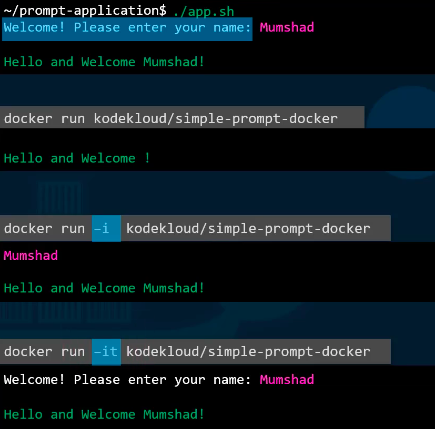
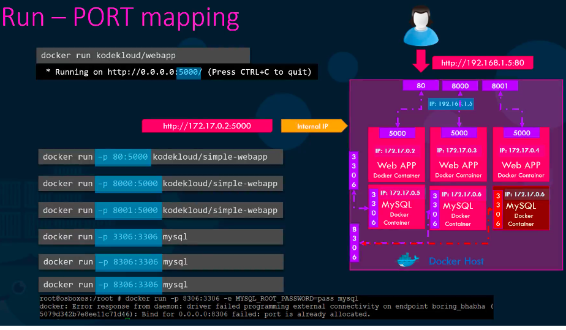
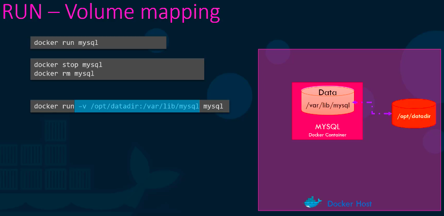
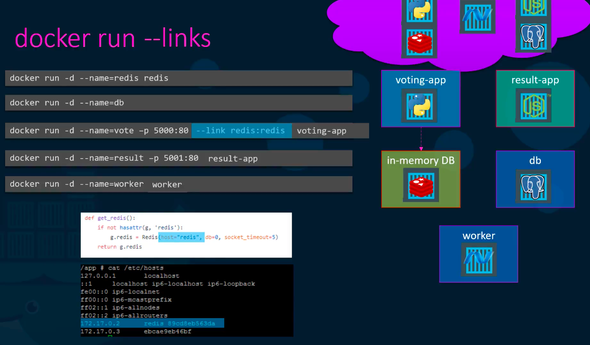
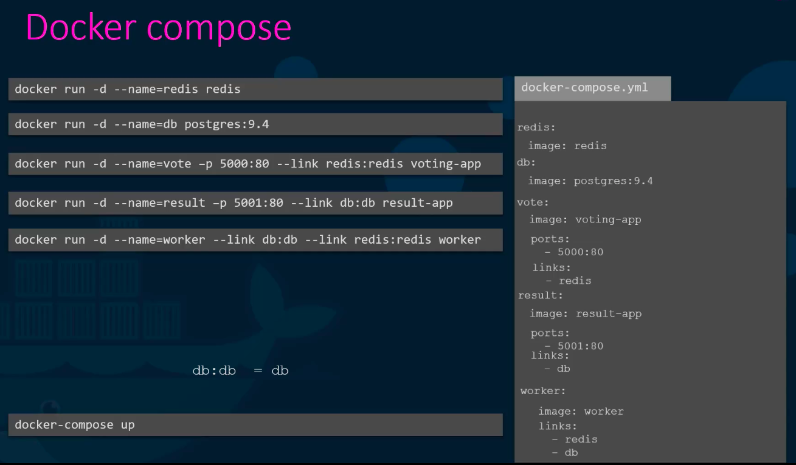
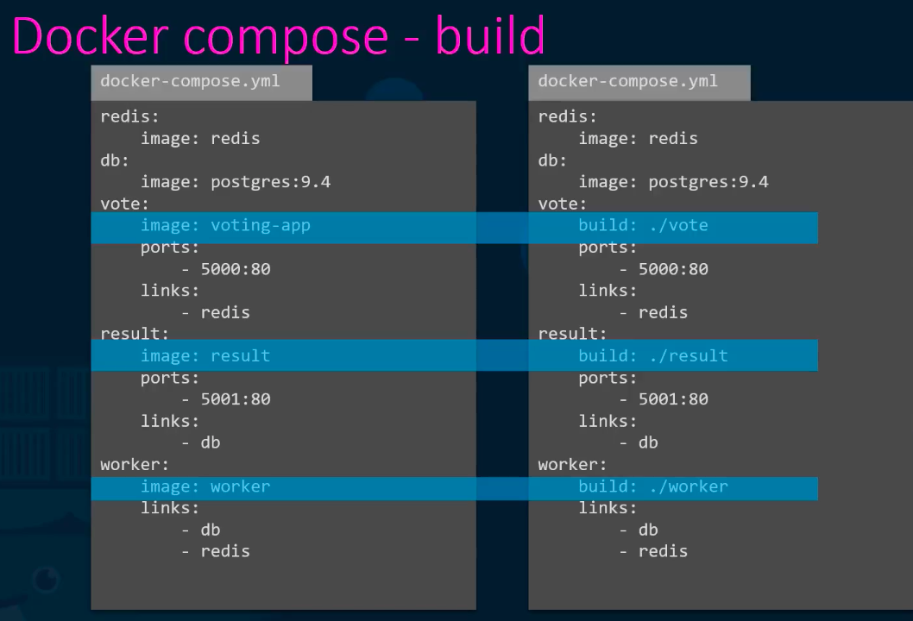
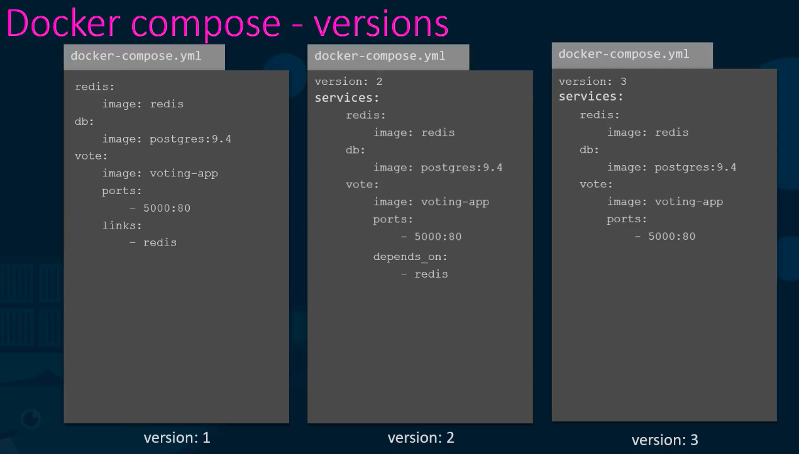
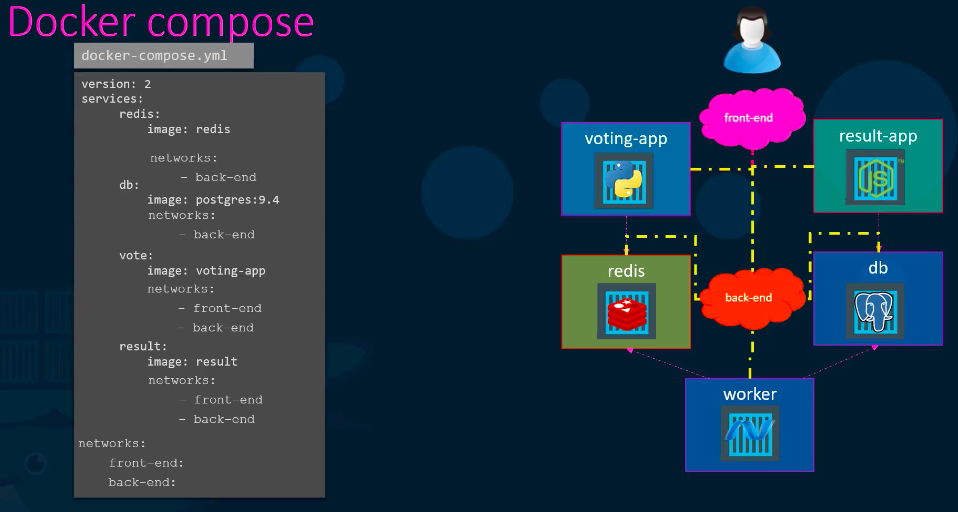

# Docker basics
- Used for running containerized applications
- Check additional notes on docker here as well - [../../../jupyter_projects/Notes.ipynb](../../../jupyter_projects/Notes.ipynb)
## Basic docker commands
__Containers__
- `docker run <image>` start a container (will download the image from docker hub if not found locally)
- `docker ps` list running containers
- `docker ps -a` list running + stopped containers (-a: all)
- `docker stop <container_name>` to stop a container
- `docker rm <stopped_container>` to remove stopped container

__Images__
- `docker images` list all images
- `docker rmi <image>` delete image
> delete all dependent containers to remove image
- `docker pull <image>` to download the image from docker hub

------
- unlike virtual hosts, docker is not meant to run OS e.g ubuntu. Docker container will run as long as any process inside it is running and docker OS e.g `docker run ubuntu` does not run any process by itself and that is why the container will exit as soon as you run it
- containers are meant to run only specific tasks or process/services e.g  to host application server or web server or database or some kind of analysis or computational task
- a container lives as long as the process inside it lives. If the web service (as an example) inside it is stopped or crashed, the container exits
-----
- `docker run <image> <command>` to run any command/process __while starting__ the container e.g `docker run ubuntu sleep 5`
- `docker exec <container> <command>` to execute a command on a running container

__Run - attach and detach__
- `docker run -d <image>` run container in background (detached state)
- `docker attach <container_id>` bring container to foreground i.e to console stdout (attached state)
> to exit from foreground, you need to quit the process e.g by CTRL+C
-----
__Run - STDIN__ (`-it` flags)
- Let's say we have an application "app.sh" that asks for our name and then greets us e.g
    
    - __First scenario:__ we run the application script; it provides a message and asks us for input
    - __Second scenario:__ we run the application using docker; it doesn't provide a message nor does it asks us for input; but directly prints the final message; this is because the container terminal is not interacting with our terminal
    - __Third scenario:__ we run the docker app with `-i` flag; now it prompts for the user input; this is because the flag is allowing us to interact with the docker app; but we still can't see the message "Welcome! Please enter your name: "
    - __Fourth scenario:__ we run the docker app with an additional `-t` flag; this is showing us the message in stdout; the flag `-t` is for stdout terminal
    > We use `-it` flag with `docker run` while running the application to interact with the terminal of the docker container
-----
> The underlying host where docker is installed is called __docker host__ or __docker engine__

__Run - Port Mapping__ (`-p` flag)
- docker container gets its own IP
- If we are running a containerized web application that listens on port 5000 then there are 2 options to reach to web app
    - 1. we use the internal docker IP and port e.g `http://172.17.0.2:5000`. But as the IP is an internal one, user outside the docker host won't be able to access it.
    - 2. we can use the docker host IP by mapping free port of docker host to the port of docker container by `docker run -p 80:5000 kodekloud/simple-webapp` and thus access it outside the docker host by using `http://192.168.1.5:80` as an example from the image
    - Similary we can run multiple instances by running them on multiple ports of docker host
    - Also, we can run multiple applications by exposing them on unique free ports of docker host
    - Note: we cannot run two applications on same port
    
-----
__Run - Volume Mapping__ (`-v` flag)
- docker container has its own separate filesystem isolated from docker host
- this means if the container is gone, the data stored in the filesystem is gone
- to keep data persistent outside the container we can map it to filesystem of docker host e.g
    `docker run -v /opt/datadir:/var/lib/mysql mysql` as shown in the below image
    
- `docker ps` gives info about the containers running but to get detailed info about a container one can use `docker inspect <container_name>`
- `docker inspect <container/image>` detailed info in json format about the container such as IP, volume mounts etc.
- `docker logs <container_name>` to check the logs produced by the containerized app
-----
__Run - Environment Variable__ (`-e` flag)
- `docker run -e NAME=value <image>` passes NAME=value as the environment variable to the container
> To check the environment variable passed to a container use `docker inspect <container>`
-----
## CMD vs ENTRYPOINT
- CMD syntax
    - `CMD command param1` e.g CMD sleep 5
    - or in JSON format as list of strings: `CMD ["command", "param1"]` e.g CMD ["sleep", "1"]
- ENTRYPOINT syntax
    - `ENTRYPOINT ["command"]`
- In case of CMD option, if we have to customize the way docker container starts by passing command line arguments during docker run, then the CMD get's overriden but in case of ENTRYPOINT it gets appended
- For e.g lets consider docker app that sleeps for 5 seconds
```dockerfile
FROM Ubuntu
CMD sleep 5
```
- In the above case when we run the container, it will sleep for 5 seconds and then quit
- If we have to customize and make it sleep for 10 seconds then we have to do `docker run ubuntu-sleeper sleep 10` (ubuntu-sleeper is the name of image here)
- In this case the `CMD sleep 5` gets replaced by `CMD sleep 10`. But as the app name suggests that it's a sleeper app, it's not ideal to give command everytime we need to change the sleep value. In that case we can use ENTRYPOINT
```dockerfile
FROM Ubuntu
ENTRYPOINT ["sleep"]
```
- In the above case when we run the container, we need to provide the sleep argument e.g `docker run ubuntu-sleeper 2`
- The argument 2 will get appended to sleep command of ENTRYPOINT
- In this case if we run the container without providing any sleep argument then it'll fail with prompt "missing operand"
- In this case we can give default value by making use of `CMD` and `ENTRYPOINT` like below - 
```dockerfile
FROM Ubuntu
ENTRYPOINT ["sleep"]
CMD ["5"]
```
- This will use sleep as entrypoint command and 5 as the default argument for it. If you want to provide a custom value you can use `docker run ubuntu-sleeper 3` and this will override the CMD value
> Note here that we using CMD with ENTRYPOINT, the CMD has to be in JSON format
-----
## Docker Compose
- It's an easier way of running, configuring and maintaining various container apps  on a single docker host
__Run - Links__ (`--links` flag)
- to link two containers together
- it has been deprecated as there is better way to do it with docker swarm and networking but good to know this to build the basics
    - 
- the first argument after the links flag is the container name (redis) and the second is host name (redis). If you don't provide the second argument then it takes the same name as first argument e.g --links redis:redis is same as --links redis
- what it does is create an entry in the app container under /etc/hosts about the redis container


- `docker-compose up -d` to bring up the stack of container(s) in the background

- In the above image, if docker-compose doesn't find the image on docker host then it will try to pull the image from docker hub e.g redis and postgres:9.4 but if we want to provide our own dockerfile then we can use `build` key and provide the path of it

__Docker Versions__

- Version 1:
    - there was no way to deploy container on other network other than default  bridge n/w
    - there was no dependency feature for containers for e.g if one container needs to be up before some other container
- Version 2:
    - it resolved both the drawbacks of Version 1 above
    - format also changed a little bit with introduction of `version`, `services` and `network` sections
    - with v2 docker compose automatically creates dedicated bridge n/w and then attaches all containers to that n/w
    - with this, we don't need to explicitly add `links` because all containers can communicate to each other by the service name
    - as you can see in v2 image above, we can use `depends_on` feature to create the order of containers created first
- Version 3:
    - latest as of today but is similar to v2
    - comes with support of docker swarm

__Support of Networks in Version 2 and above__
    - If we want to make use of separate n/w instead of the default bridged n/w created by docker compose, we can use v2 to connect the containers to those custom networks as desired
    