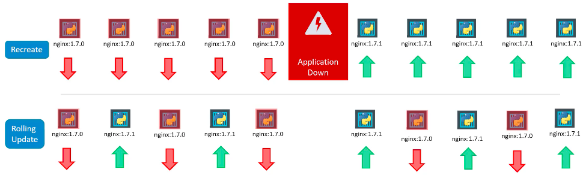
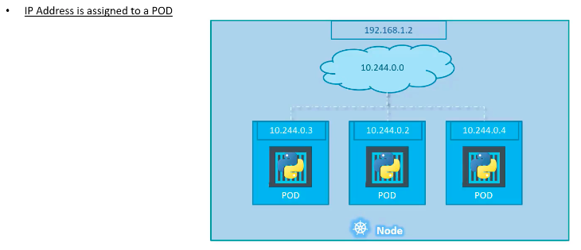
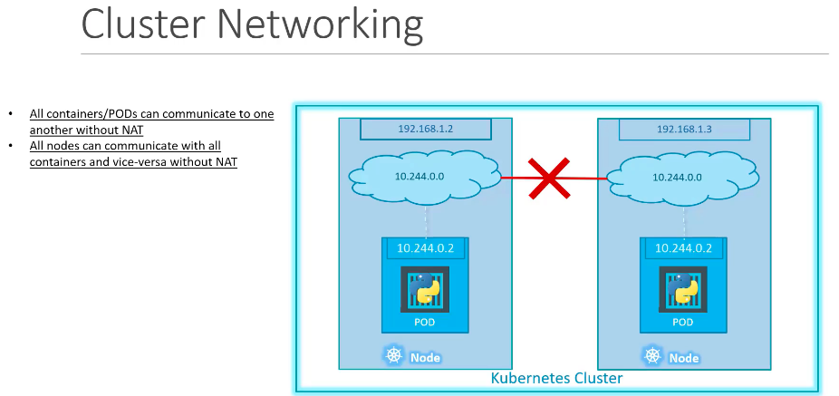
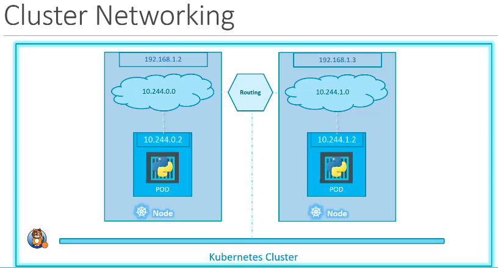

# Kubernetes Basics
- It is a container orchestration tool
- It is also known as K8s
## Kubernetes Architecture
### Nodes
- A node is a machine where k8s is installed
- It is a worker machine where containers are launched by kubernetes
- Previously nodes were called minions
### Cluster
- It is a set of nodes to fail-safe the containerized application in case 1 or more nodes fail
- Also having more nodes help in sharing loads
### Master
- It is another node where k8s is installed and is configured as a master
- It watches over the nodes in the cluster and is responsible for actual orchestration of the containers on the worker nodes
### Components
- When we install kubernetes, 5 components gets installed with it
1. `API server`
    - acts as a frontend for kubernetes
    - users, management services, cli all talk to API server to interact with cluster
2. `etcd`
    - it is a distributed key-value store to store info used to manage the cluster
    - when you have multiple masters and multiple nodes in a cluster, etcd stores all that info in all the nodes in a distributed manner
    - it is responsible for implementing locks within cluster to ensure any conflict b/w masters
3. `scheduler`
    - responsible for distributing loads for containers across multiple nodes
    - it looks for new created containers and assign them to nodes
4. `controller`
    - brain behind orchestration; responsible for noticing and responding when __nodes, containers and endpoints__ go down
    - makes decision in such cases to bring new containers
5. `container runtime`
    - underlying software for running containers; in our case docker
6. `kubelet`
    - agent that runs on each node in the cluster
    - agent makes sure that the container is running on node as expected

Below image shows the main difference (through the components) b/w master and worker nodes


### kubectl
- it's a command line utility tool; also known as kube control tool
- used to deploy and manage application on kubernetes cluster, to get cluster info, to get status of other nodes in the cluster and manage many other things
- `kubectl run hello-minikube` to deploy application in cluster
- `kubectl cluster-info` to view info about the cluster
- `kubectl get nodes` to list all nodes part of the cluster
-----
## <a id="pods"></a>Pods
- Kubernetes doesn't deploy containers on the worker node; they are wrapped on k8s object called pods
- Pod is a single instance of an application; it has 1-1 relation with application
- Below image shows very simple example of 2 pods on a node and if the node can't take the load of so many users accessing the application, new pod on new node is used
    
- You can't have multiple application instances on a singe pod but we can have different container types on same pod as well as mulitple pods on a node
    
- `kubectl run nginx --image nginx` will create a pod with name nginx and get image with name "nginx" from docker hub(default lookup) and create container from it
- `kubectl get pods` to list all pods
- `kubectl get pods -o wide` to get slightly detailed info of pods like its IP and node name
- `kubectl describe pod <podname>` detailed description about the pod like its IP, node name, container name, id, its image name, node IP etc.

-----
### Pod in YAML


    - The above image shows an example of how to create a pod using yaml file
    - `apiVersion`, `kind`, `metadata` and `spec` are mandatory fields for creating any k8s objects so start by writing those fields first while creating the file
    - RHS table shows the kinds and their versions to be used in `kind` and `apiVersion` respectively
    - keys for the dictionary in `metadata` are fixed i.e `name` (name of the pod) and `labels` (to identify one pod from another e.g frontend/backend which will help in distinguishing some group of pods from another group) are keywords whereas the keys for the dictionary in `labels` are custom (meaning you can name it anything; just like tag in aws)
    - `spec` info varies depending on the type of object you create; so in this case info about container as we are creating pod
    - `kubectl create -f <filename.yml>` creates the pod object
    - `kubectl apply -f <filename.yml>` same as above (another way of creating object)
    - `kubectl get pods` to list the pods
-----
## Controller (Brain of K8s)
### Replication Controller (new: REPLICA SET) - LOAD BALANCING AND AUTO-SCALING
- replicates the pod (multiple instances of the pod) so as to have __high availablity__ of the running application
- even if you have single pod, replication controller can help in automatically bringing up the new pod if the existing one fails
> Replication Controller ensures the specified number of pods (desired capacity in aws terms) are running whether it's 1 pod or 100
- It helps in load balancing and scaling across nodes as well; see image below
    
- Replication controller is deprecated and the new alternative for it is __REPLICA SET__

### <a id="replicaset"></a>Replica Set in YAML

- Below is an examplle of replica set that creates 3 pods
```yaml
apiVersion: apps/v1
kind: ReplicaSet
metadata:
    name: myapp-replicaset
    labels:
        app: myapp
        type: frontend
spec:
    template:  # put pod definition below

        metadata:
            name: myapp-pod
            labels:
                app: myapp
                type: frontend
        spec:
            containers:
            - name: nginx
              image: nginx

    replicas: 3  # desired capacity of pods
    selector:  # which pods to take care of
        matchLabels:
            type: frontend
```
- here the selector property is mandatory and in matchLabels we need to give label of pods that should be included in this replica set
- with selector you can apply different kind of matches to group pods
- with selector, replica set can also manage pods that were not created as part of the template
- `kubectl create -f <replicateset-definition.yml>` to create replicaset object
- `kubectl get replicaset` to see created replicasets
- template section is required so that replicaset can use that definition to create pods when scaling out
- if you provide template and the pods were previously created and running and in `matchLabels` you have those pods then it won't create new pods if the desired capacity is matched
- Similarly if there are more pods than desired which matches the label in replicaset then some of them will be automatically deleted
- 2 options to increase/decrease the number of replicas in future
    1. change the definition file e.g from `replicas: 3` to `replicas: 6` and then use
        `kubectl replace -f <replicateset-definition.yml>`
    2. directly through command which will __NOT__ change the definition file
        `kubectl scale --replicas=6 -f <replicateset-definition.yml>`
                            OR
        `kubectl scale --replicas=6 replicaset myapp-replicaset`
                                      |--> type      |--> name
### Labels and Selectors
- Labels are used so that selectors can filter pods based on matchLabels as there can be 100s of other pods which we may not want to monitor with replicaset
### <a id="replicaset-command"></a>Summary of replicaset commands
```bash
    $ kubectl create -f <example_replica.yml>               # create
    $ kubectl get replicaset                                # check
    $ kubectl replace -f <example_replica.yml>              # edit
    $ kubectl scale --replicas=6 -f <example_replica.yml>   # edit
    $ kubectl edit replicaset <replica_object>              # edit in memory; careful that it doesn't propagate changes to existing replicaset
    $ kubectl delete replicaset myapp-replicaset            # delete; also deletes all underlying PODs
```
> Use `rs` instead of `replicaset` to save time in commandline

> If you run into a scenario where you don't have replicaset definition file but just running object of it, then you can export the definition using
    `kubectl get rs <rs_object> -o yaml > new_replica.yml`
-----
## <a id="deployment"></a>Deployments
- So far we talked about pods which deploy single instance of an application. Each container is encapsulated in such pod. Multiple pods are deployed using replica set
- And then come kubernetes object that comes higher up in hierarchy and provides us the capabilities to
    - upgrade underlying instances seamlessly using `rolling updates`
    - `undo change` (rollback if something went wrong on upgrade), `pause` and `resume` changes (to make all changes together in all instances) as required
- Everything in k8s deployment object is same as replicaset except the kind value which changes to __"Deployment"__
- `kubectl create -f <deployment-definition.yml>` to create deployment object
- `kubectl get deployments` to get deployment object
- `kubectl get all` to get all objects i.e deployment, replicaset, pods

### Deployments - Update and Rollback

    
    UPDATE:
    1. Recreate
        - first destroy all the instances and then deploy new instances of the application
        - has the side-effect of application downtime

    2. Rolling Update
        - we take down the older version and bring up a newer version one by one
        - application never goes down and the upgrade is seamless
        - this is the default deployment strategy
> Run `kubectl describe depoloyments <deployment_object>` to see the deployment strategy used

> Under the hood, in case of rolling update, k8s create another replicaset and start deploying the applications there and at the same time taking down the applications in the old replicaset. This can be seen with `kubectl get rs` which shows old rs with 0 pods and new rs with desired pods

    ROLLBACK
    - Similarly in case of rollback, k8s restore the previous replicaset and tear down latest rs one by one

### <a id="deployments-command"></a> Deployments Command
- `kubectl create -f <deployment-definition.yml> --record`  to create deployments object (record flag records the command used when we see `describe command`)
- `kubectl get deployments`                                 to get the deployments
- `kubectl apply -f <deployment-definition.yml>`            to update the deployment
- `kubectl rollout status <deployment_object>`              to see the status of the deployment
- `kubectl rollout history <deployment_object>`             to see the revision and history of deployment
- `kubectl rollout undo <deployment_object>`                to rollback deployment operation
-----
## Networking


    - IP Address assigned to the pod is emphemeral
    - When k8s is initially configured, we give it a subnet

    
    - K8s wants us to do the networking so that
        - all containers/pods can communicate to one another without NAT
        - all nodes can communicate with all containers and vice-versa without NAT
    - There are a couple of pre-built solutions available that can do that for us like cisco, flannel etc

    
    - The above image shows cluster with custom newtwork solution 


-----
## SUMMARY
- [Nodes](#nodes)
- [Pods](#pods)
- [ReplicaSet](#replicaset)
    - [ReplicaSet Command](#replicaset-command)
- [Deployments](#deployment)
    - [Deployments Command](#deployments-command)