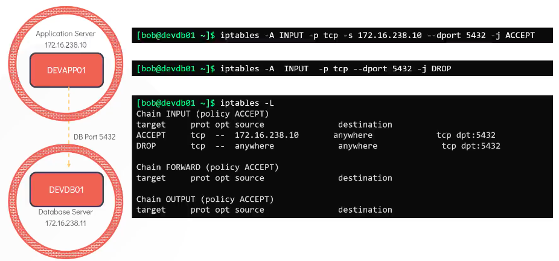
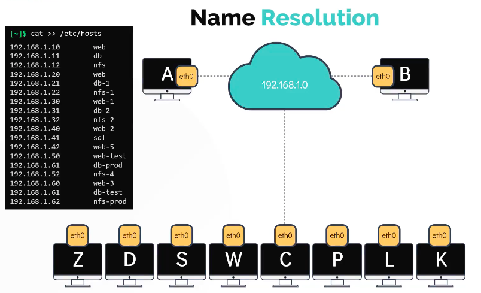
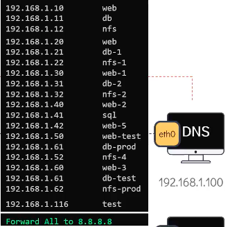
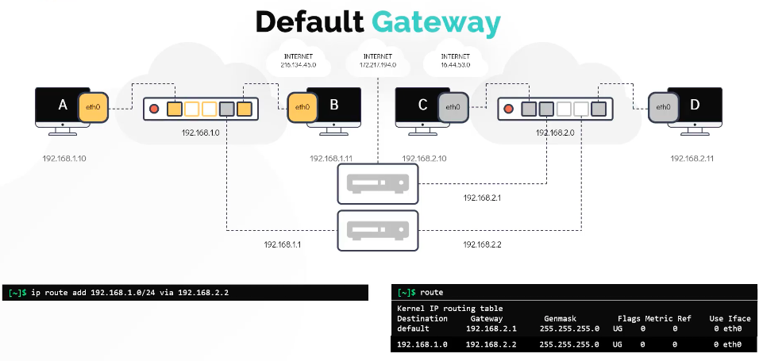
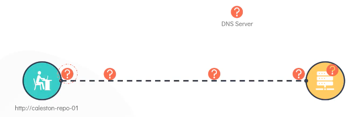
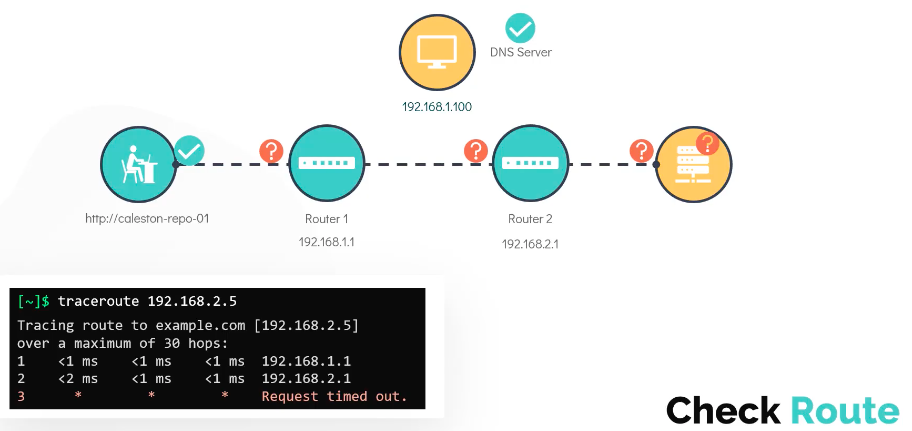

## Linux basics
[More detailed notes of the course](https://github.com/kodekloudhub/linux-basics-course)

- `/home` is where all users by default get their space (think of it as locker)

- `type <command>` : tells if command is internal(comes with shell) or external(installed by linux distribution)
- `uptime` shows how long system has been running
- `ls -lt` **long list files in order created (newest to oldest)**
- `ls -ltr` long list files in reverse order created (oldest first)
-----
## Environment variable
- `echo $SHELL` prints value of shell (which is an environment variable)
- `env` lists all environment variables
- `export NAME=VALUE` creates
- `.profile` or `.pam_environment` to persist environment variable from logout/reboot
-----
## Path variable
- `echo $PATH` list of paths where shell searches for when an external command is used
- `which <command>` to check the location/path of the command; if no result then path not in _path variable_
- `export PATH=$PATH:<path/of/command>` to add location of external command to path variable

- `alias up=uptime` will set shortcut up for the actual command uptime
- `echo 'alias up=uptime' >> ~/.profile` to make persistent alias by putting it on profile
-----
## Kernel
- Analogy of a librarian as an intermediator b/w books and students
- `uname` info about the kernel
- `uname -r` info about the kernel version
__Hardwares__
- `lsblk` lists information about the block devices (physical disk and its partitions)

- `lscpu` detailed information about the cpu, its cores and threads

- `lsmem --summary` gives information about the total memory
- `free -m` gives information about the total vs used memory in "mb" (-k for kb and -g for gb)

- `lshw` to get detailed information about the entire hardware configuration
-----
## Boot Sequence Stages
1. `BIOS POST`(Power On Self Test)
    - Here BIOS runs test to ensure hardwares attached to the device are healthy
    - If found unhealthy, the system may not be operable and may not proceed to second stage
2. `Bootloader (GRUB2)`
    - BIOS loads the boot code from the boot device which is located on the first sector of the hard drive
    - In linux it is located at the `/boot` file system
    - Bootloader provides the user with the boot screen often with an option to boot Ubuntu or Windows in an example of a dual boot system
    - Once the selection is made at the boot screen, the bootloader loads the kernel(based on the selection) into the memory, supplies it with some parameters and handover the control to the kernel
    - A popular example of bootloader is GRUB2 (Grand Unified Bootlaoder)
3. `Kernel Initialization`
    - Kernels are usually in compressed state to save space
    - After the kernel is selected, it is decompreseed
    - It performs hardware initialization and some other memory management tasks among other things
    - After it is completely operational, the kernel looks for INIT Process to run which sets up the __USER SPACE__ and the processes needed for the user environment
4. `INIT Process (systemd)`
    - In most linux distros, the INIT process calls the __systemd__
    - __systemd__ is responsible for bringing the linux system into a usable state
    - __systemd__ is responsible for
        1. mounting file system
        2. starting and managing services
    - In some linux distros, the INIT process have sys5 instead of systemd
    - `ls -la /sbin/init` **to check the INIT system used**
-----
## Run level (systemd targets)
- During boot, INIT process checks the value of `runlevel`
- Linux can run in different runlevels. If runlevel=5, systemd of INIT process calls function to enable display manager service for GUI. With runlevel=3, it boots into CLI
- `runlevel` to check your systems runlevel value
- In systemd's language 5 is called __graphical.target__ while 3 is called __multi-user.target__
- `systemctl get-default` to see the default target in your system
> This command looks at the file located at `ls -ltr /etc/systemd/system/default.target`
- `systemctl set-default multi-user.target` to change the default systemd target (runlevel)
-----
## File types (everything is file in linux)
1. **Regular** file: e.g images, scripts, configuration files
2. **Directory** file: e.g /home/bob, /home/bob/code-directory
3. **Special** files
    1. *Character* files: represents devices under `/dev` file system which allows the OS to communicate to IO devices serially e.g mouse, keyboard
    2. *Block* files: representing block devices located under `/dev` e.g hard-disk and RAM
    3. *Links*: to associate 2 or more filenames to the same set of file data
        - Hardlinks: 2 or more filenames sharing same data. deleting one deletes the data
        - softlinks (symlinks): pointers to another file. deleting syslink doesn't delete data
    4. *Socket*: files that enable the communication b/w 2 processes
    5. *Named pipes*: allows connecting one process as an input to another process. data flows unidirectionally from one process to another


-----
## Filesystem Hierarchy
- `df -hP` (disk free or disk filesystem) prints info about all the mounted filesystem
- Detailed info about each file system - https://www.linux.com/training-tutorials/linux-filesystem-explained/

> /etc : **E**verything related **T**o **C**onfiguration
-----
## Package Managers
### Some of the packages types
1. __.deb__
- Debian, Ubuntu, Linux Mint etc.
- Example of package managers for this kind of packages
    1. `dpkg` - base package manager for debian based distributions
    2. `apt` - newer frontend for dpkg system
    3. `apt-get` - traditional frontend for dpkg system
2. __.rpm__
- RHEL (Red Hat Enterprise Linux), Fedora, CentOS
- Example of package managers for this kind of packages
    1. `rpm` - base package manager for red hat based distributions
    2. `yum` - frontend for rpm system
    3. `dnf` - more feature rich frontend for rpm system

### YUM
- depends on software repos which contains 100s of packages (rpm package files)
- these repos can be hosted locally or remotely
- `/etc/yum.repos.d` contains info about the repos
- `/etc/yum.repos.d/redhat.repo` file that contains info about the official red hat repo
- What happens when we run `yum install <package>`
    1. yum runs a transaction check
        1. checks if package is already installed
        2. If not, then yum checks the configured repos under `/etc/yum.repos.d` for the availability of the requested package
        3. It also checks if any of the dependency packages are already installed or need to be upgraded
    2. transaction summary is displayed for review
    3. If user types 'yes' to summary, package gets installed
- `yum repolist` shows all the repos added to your system
- `yum install <package> | remove <package> | update <package> | update`
- `man yum` for yum related commands
- `rpm -qa | grep wget` to know the exact package of wget(and version) installed (q: query; a: all)

### APT
- `/etc/apt/sources.list` contains info about the repos; you can edit it to add more repos to it
- `apt update` refresh repo
- `apt upgrade` update packages installed
- `apt install <package> | remove <package>`
- `apt search <package>` to search for package in the repos e.g `apt search chromium` will give you exact name of the package to install
- `apt list` available, installed and upgradable packages
- `apt list | grep <package>`
-----
## Files
- `du -sh <file>` **tells you the size of the file (-s: specified file, -h: human readable format)**
- `ls -lh <file>` can also tell you about the size of the file

### tar (take archive)
- files created with tar are often called __tar balls__
- `tar -cf test.tar file1 file2 file3` -c: create -f: filename/tar ball to be created
> e.g to create tarball of python folder: `tar -cf /home/bob/python.tar /home/bob/reptile/snake/python`
- `tar -tf test.tar` to see contents of tar ball
- `tar -xf test.tar` to extract content of tar ball
- `tar -zcf test.tar file1 file2 file3` -z: to compress the tarball to reduce its size

### compression
- some pre-installed compression tools in Linux

- they vary by their compression algorithms and hence notice the compressed size in the above picture
> e.g to tar a directory and compress it with gzip: `tar -cf ~/python.tar ~/reptile/snake/python && gzip ~/python.tar`
- `zcat | bzcat | xzcat` tools to read content of compressed file without uncompressing it


### searching for files
- `locate <filename>` prints all paths matching the keyword
> The downside of `locate` is that it depends on local database for querying the filename and if you have installed linux recently or file was created recently, then this may or may not yield the result
as the database may not have been updated of the file
- `updatedb` to manually update the db (needs sudo privilege)
- `find /home/bob -name city.txt` **to search for file under /home/bob**
> `find` has many other powerful options

### searching for content within file (GREP)


> -w: for exact word; -A: after; -B: before; 

> Useful: `grep -r "text to find" <directory>` **will give you both the text and filename**
-----

## IO Redirection
### STDOUT
- `echo $SHELL > shell.txt` overwrite data to file
- `echo "This is bash shell" >> shell.txt` append data to file
### STDERR
- `cat missing_file 2> error.txt` overwrite error to file
- `cat missing_file 2>> error.txt` append error to file
- `cat missing_file 2> /dev/null` **dump the error if any to null (don't show the error to screen)**
### TEE
- `echo $SHELL | tee shell.txt` prints to screen first and then overwrites data to file
- `echo $SHELL | tee -a shell.txt` **prints to screen as well as appends data to file**
-----
## VI editor


### Command mode
- `yy` copy a line
- `p` paste
- `x` delete a letter
- `dd` delete a line
- `d3d` delete 3 lines from current line (`dnd` delete n lines from current line)
- `u` undo previous change
- `r` redo previous change


### Lastline mode
- `:w` save without exiting
- `:q` quit (will throw error if you did not save changes)
- `:wq` save and quit
- `:q!` discard changes and quit

> VIM is improved version of VI with features such as completion, spell check, plugins etc. Nowadays vi is a symbolic link to vim (to check do `ls -ltr $(which vi)`)
-----
## USER
- `/etc/passwd` db file containing info about the user account (each user gets unique id `uid`)
- `/etc/group` db file containing info about the group (each group gets unique gruop id `gid`)

Some explanation about the above image:
    - User account contains follwing info about the user:
        - username, uid, gid, home directory, default shell
    - while creating the user, if no group is specified, it is assigned the same gid and group name as the uid and username. That group becomes its primary group. A user can be part of multiple groups
    - `id michael` to get info about the user michael
    - `grep -i michael /etc/passwd` to get detailed user account info about michael

### Commands to see details about the user (stalk users)
- `id` gives info about the current user (uid, gid and the groups it belongs to)
- `who` to see the list of users currently logged in to the system
- `last` record about all the logged in users; also the time of last reboot

### Switch users
- `su bob` switches to bob (requires bob's password)
- `su` by default switches to root

### Sudo
- `cat /etc/sudoers` shows default configuration for sudoer file
> Only the members listed in sudoers file can use the sudo command for priveleged escalations. This is an added security to prevent other users from running command as root user

### Syntax of sudoers file
- 1st field: either user or group; group starts with `%`
- 2nd field: machine/hosts; either localhost or ALL (by default)
- 3rd field: (optional) user or user:group
- 4th field: command which the user (in 1st field) is permitted to run on machine specified in 2nd field as user (by default ALL) specified in 3rd field


```bash
# root and users in group wheel can run anything on any machine as any user
root		ALL = (ALL) ALL
%admin		ALL = (ALL) ALL
```

### Creating users (with default configurations)
- `useradd bob` create user bob
- `passwd bob` to create password for bob
> Both the commands have to be run as root
- `grep -i bob /etc/passwd` to see info about the (newly created) user bob
- `whoami` to check your username
- `passwd` to change your password

### Creating users (with custom configuration)


### Group and delete commands
- `userdel bob` delete user bob
- `groupadd -g 1011 developer` add group developer with custom group id 1011
- `groupdel developer` delete group developer

> A better alternative of `useradd` is `adduser` which under the hood uses `useradd` as symbolic link or perl script but prompts user for various options instead of custom configuration flags.
> But some distros doesn't have `adduser`

## Access Control Files
1. `/etc/passwd` info about user account

> x: means password is hidden; GECOS: is csv or comma separated format of user info such as fullname, location, phone number etc.

2. `/etc/shadow` info about user password and expiry

> PASSWORD: is encrypted, empty means password not set for the user; LASTCHANGE: date since the password was last change, value is in epoch (unix timestamp); MINAGE: min days user __has to wait__ before he/she can change passwd; MAXAGE: max days before which the user __has to change passwd__; WARN: number of days user has to be warned before the password gets expired; INACTIVE: no. of days after the passwd has expired which should still be accepted before being disabled; EXPDATE: expiry date after which the account will be expired

3. `/etc/group` info about group

    

-----
## SSH
- `ssh <hostname or ip_address>` tries to login to remote server using the current username
- `ssh bob@devapp1>` login to host devapp1 with username bob
> Both the above commands will prompt for password
### Password-less SSH (using key pair)
To perform password-less ssh to remote server we need to copy our public ssh key to remote server under `~/.ssh/authorized_keys` file
- `ssh-keygen -t rsa` creates public and private key at `~/.ssh/`
- `ssh-copy-id bob@devapp1` copies your public ssh key to a file (in `~/.ssh/authorized_keys`) in remote host called devapp1
> This command will prompt you for the password but next time when you ssh into that machine, it won't ask your password
-----
## SCP
Utility tool to copy files/directories to remote server using ssh. As long as you have remote access to server via ssh you can use this command.
- `scp /home/bob/test.tar.gz devapp1:/home/bob` copy the zip file to home directory of remote server devapp1
- `scp -pr /home/bob/media/ devapp1:/home/bob` r: directory; p: preserve ownership and permission
-----
## IPTABLES
- To filter network traffic (IP + Port)
- Installed by default on redhat family but may not on debian family
- `sudo apt install iptables` to install iptables
- `sudo iptables -L` show iptables configuration
- It consists of 3 rules/chain
    1. Chain INPUT (Inbound)
    2. Chain OUTPUT (Outbound)
    3. Chain FORWARD (to forward traffic to another server (like reverse proxy), hardly used)

    

> In the above image "Client B" can access remote server because there is no deny rule in iptables. By default it allows all to connect (IMPLICIT ALLOW).

- `iptables -A INPUT -p tcp --dport 22 -j DROP` denies access to port from anywhere (source not provided means "all" by default); this will solve our problem in above image of clientB being able to connect which was a breach for us

> The sequence in which rules are applied in IPTABLES are very important because that's how they are applied 

- That said, if you have already put some rule in iptables and now you want to add a rule at the top then you can use `-I` option instead of `-A`. That way you can put the rule at the top instead of bottom.
- `iptables -D OUTPUT 5` delete 5th rule from OUTPUT chain table

### empheral port

Looking at the above picture, when you make a request to db server on port 5432 from app server, then the db server might send you the query result at some port. If db sends the response to app server at port say 44060 then that would be an ephemeral port. Ephemeral port ranges b/w 32768-60999. What it means is that those port ranges are not static and thus next query response from db to app server might be on a different port and not necessarily 44060.
-----
## CRONJOBS
- `crontab -e` opens crobjob file where you can put __time and command__
- `crontab -l` list all created cronjobs
- `tail /var/log/sys.log` stores all the cron jobs that were run successfully
    
-----
## DNS
- Whenever you type `ping db`, or `ssh db` or `curl http://www.google.com`, system looks at `/etc/hosts` for the ip correspong to the hostname.
- Translating hostname to IP address this way is called __NAME RESOLUTION__
- `ping`, `nslookup` and `dig` are some of the commands to test dns resolution. It might also be the case that in some system `ping` is disabled
- Back in the earlier days, we had small network and thus managing __name resolution__ in `/etc/hosts` was feasible. But with bigger networks in current days, it is hard to manage in a single file and also if ip for any host changes then we need to change in every hosts `/etc/hosts` file

- To solve this, we use centralised server called __DNS Server__ to manage __name resolution__. Every hosts points to this server
- `/etc/resolv.conf` every host has this dns resolution configuration file that specifies the address of the dns server
- every time the host comes across a hostname that it does not know about, it looks it up from the dns server specified in `/etc/resolv.conf`
- now that doesn't mean you can't have entry in your `/etc/hosts` file. For e.g to test your test server or local server, you can put its name resolution in `/etc/hosts` file
- by default, the host first looks at the `/etc/hosts` file and then to __dns nameserver__
- `/etc/nsswitch.conf` this file determines the above order i.e to look at files (`/etc/hosts`) first and then to __nameserver__. Example below - 
```bash
[~]$ cat /etc/nsswitch.conf
...
hosts:      files dns
...
```
- you can change the order by modifying this file
- what if you want to ping server that is not hosted on your DNS server e.g `ping www.facebook.com`
- in that case you can add another nameserver that knows about that host/server
- one such example of publicly hosted nameserver is `8.8.8.8` managed by google. Example below -
```bash
[~]$ cat /etc/resolv.conf
nameserver      192.168.1.100
nameserver      8.8.8.8
```
here 192.168.1.100 is an example of our self-hosted dns server to resolve our local dns name resolution and 8.8.8.8 to resolve public dns name resolutions
- but again this way we'll have to maintain nameservers locally
- So, another solution is to forward all unknown hostnames to 8.8.8.8 by making an entry in our own hosted dns server. Example below -

    

- In your organization dns server, you might have a lot of sub-domains like wiki.mycompany.com, git.mycompany.com, jira.mycompany.com etc. If you don't want to type mycompany.com everytime for your internal company services, you can use `search` in `/etc/resolv.conf` to search for domain. Example -
```bash
[~]$ cat /etc/resolv.conf
nameserver      192.168.1.100
search          mycompany.com     prod.mycompany.com
```
-----
### Record Types
- determines how the records are stored in dns server
- Some of the many record types -
1. A record: storing IPv4 to hostname
2. AAAA record (quad A): storing IPv6 to hostname
3. CNAME record: storing one name to another (like an alias)
-----
### Tools to test dns name resolution
`ping www.google.com` checks `/etc/hosts` first to resolve
`nslookup www.google.com` query hostname from dns server; it doesn't check `/etc/hosts`
`dig www.google.com` returns more detailed info in the similar form as is stored in dns server
-----
## NETWORK BASICS
- If network is a room then gateway is the door. We can take the analogy of family in a house as network. If "Khan" family has to reach each other then they don't need a gateway which means "0.0.0.0" entry in the gateway field. But if "Khan" family has to reach "Kapoor" family then they need to know the door of the gateway through which they can go out and talk to "Khan" family.
- "Khan" family has lot of friends and thus they need route table to remember other families and the gateway/door to reach them
- As discussed above, to talk among their own family members they don't need any gateway, hence "0.0.0.0" in the gateway entry field of the table
- `route` to see the table
- `ip route add <network_you_want_to_reach> via <gateway>` add entry to route table
    
- In the above image, we have two route tables, one for internal network and the other for internet
- Destination set as "default" (also means "0.0.0.0") means if the router can't resolve the ip or network then it will use the specified gateway to try to reach that network e.g to reach google etc.

### Key commands for network troubleshooting
- `ip link` list network interfaces on the host and their status
- `ip link set dev eth0 up` to set the status of network interface named eth0 to UP
- `ip addr` or `ip a` or `ifconfig` to see the ip addresses assigned to those interfaces
- `ip addr add 192.168.1.10/24 dev eth0` used to add ip address to the interface
- `/etc/network/interfaces` to persist the above `ip addr add` change after restart
- `ip route` or `route` to see the route table
- `ip route add 192.168.1.0/24 via 192.168.2.1` used to add entry to route table e.g `ip r add default via 192.168.2.1` will add default route via 192.168.2.1
- `telnet <host/ip_address> <port>` protocol similar to ssh to connect to remote server; ssh is more secure than telnet protocol e.g `telnet devapp-01 80` to connect to host devapp-01 via http

### Network troubleshoot scenario
- Bob is trying to connect to a repository server URL "http://caleston-repo-01" but getting connection timeout error
    
- This could be because of variety of reasons
    
- Let's go through the standard network troubleshoot techniques (POST-MORTEM):
    1. __CHECK INTERFACES..__
        - check host ip connectivity to ensure the primary interface is __UP__
        - `ip link`
    2. __CHECK DNS RESOLUTION...__
        - check if we can resolve the ip address to the hostname
        ```bash
        [~]$ nslookup caleston-repo-01
        Server:         192.168.1.100
        Address:        192.168.1.100 #53

        Non-authoritative answer:
        Name:   caleston-repo-01
        Address: 192.168.2.5
        ```
        > This tells us that nslookup command is able to reach out to the DNS server which has IP __"192.168.1.100"__ and requests for the ip address of the hostname __"caleston-repo-01"__ which returns __"192.168.2.5"__

    3. __CHECK CONNECTIVITY...__
        - `ping caleston-repo-01`
        - ping is often not a best tool to check connectivity as many networks would have disabled it however it's worth a try
    4. __CHECK ROUTE...__
        - to troubleshoot an issue with the route we run `traceroute` to see the number of hops/routes between the soure (our laptop) and the repo server
        - it will also show us if there is any problem in any of the device in the network route between source and destination   
        - `traceroute  192.168.2.5`
            
        - from the output we see that there are 2 routers and the connection to them is okay
        - however the request timeout out b/w the 2nd router and the server
        - looking at the repo server will give us the idea where the issue could be
    5. __CHECK SERVICES...__
        - see if the http service is running at port 80
        - netstat command (short for __network status__) can be used to get info about the network and protocol statistics (which ports are open)
        ```bash
        [caleston-repo-01: ~]$ netstat -an | grep 80 | grep -i LISTEN
        tcp6    0       0 :::80         :::*            LISTEN
        ```
        - In this case the command flag shows the active ports in the system and we are lookign specifically if port 80 is listening on the server
        - we see that it is listening that means the web server is UP
    4. __CHECK INTERFACES...__
        - `ip link`