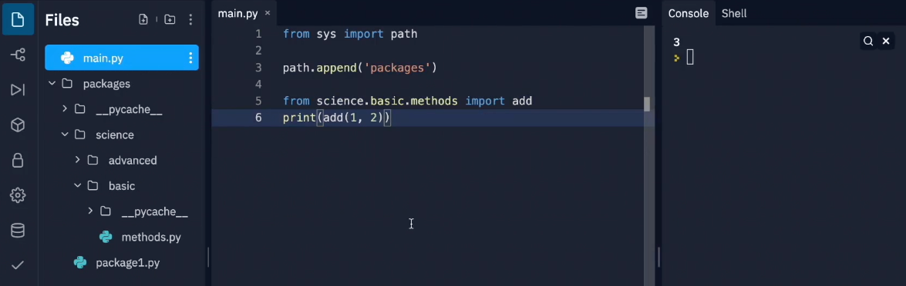
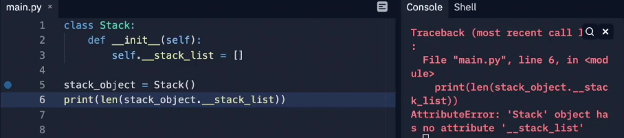

# Modules, Packages and PIP
- The initialization of modules only happens once
    * If you import the same module in different modules, python remembers the first import
    * Python initializes some extra values, one of them is a variable called `__name__`
    * The value of this variable is dependent on how the module is called
    * `__name__` = `__main__` when module is run directly
    * `__name__` = `[module_name]` when module is imported in another module
- Python looks for the modules in the current directory and in places defined by `sys.path`



    * we create packages to group modules
    * in above image python knows only about `main.py` and to use your own modules you need to tell python where to find it
- Python treats zip folder as normal folders and thus you can zip the folder/package to save some memory as well
- `pip` uses internet to query `pypi` (it's a repo) and download the desired package(s)
- `pip show <package>` gives info about who created, dependencies etc.

# OOP
## Procedural vs OOP approach


    - In procedural, data (variables) and code (functions) are separated
    - Although in above image the stach is functional, the stack variable is highly vulnerable as anyone can access it. Also, in future you may want to use more than one stack which means we need to create another push and pop
    - Simply put it's not future proof


```python
class Stack:
    def __init__(self):
        self.stack_list = []

stack_object = Stack()
print(len(stack_object.stack_list))
```
- The purpose of `__init__` is to create new instance each time a class is invoked
- In the above code we are able to access the value of `stack_list`, however we want to make that impossible for others to access it
- To hide it all we need to do is put double underscore before it

- Now it is accessible only from within the class

```python
class Stack:
    def __init__(self):
        self.__stack_list = []

    def push(self, val):
        self.__stack_list.append(val)

    def pop(self):
        val = self.__stack_list[-1]
        del self.__stack_list[-1]
        return val
```

- Now to add feature to output sum of values in the stack we can use `subclass` as we don't want the logic to be on stack itself

```python
class AddingStack(Stack):
    def __init__(self):
        Stack.__init__(self)  # not necessary as python can also implicitly do this
        self.__sum = 0

    def get_sum(self):
        return self.__sum

    def push(self, val):
        self.__sum += val
        Stack.push(val)

    def pop(self):
        val = Stack.pop(self)
        self.__sum -= val
        return val

stack = AddingStack()
stack.push(10)
stack.push(5)
print(stack.get_sum())
```
- So we usually create sub-class to do more specific task on top of the superclass
> With **inheritance** we can extend the capabilities of a class

## Polymorphism
- The ability to change superclass' behaviour
- It can keep code clean and consistent
e.g
```python
class ClassA:
    def fun(self):
        print("fun from class A")
    
    def cool_method(self):
        self.fun()

class ClassB(ClassA):
    def fun(self):
        print("fun from class B")

new_val = ClassB()
new_val.cool_method()
```

* The above code is an example of polymorphism where we are changing the behaviour of superclass by overriding it.
* As we are calling `cool_method` from instance of ClassB, it uses `self` for ClassB instance and thus `fun` of ClassB gets called


