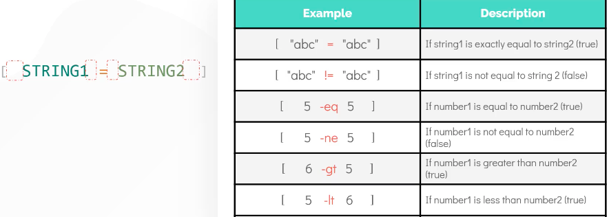
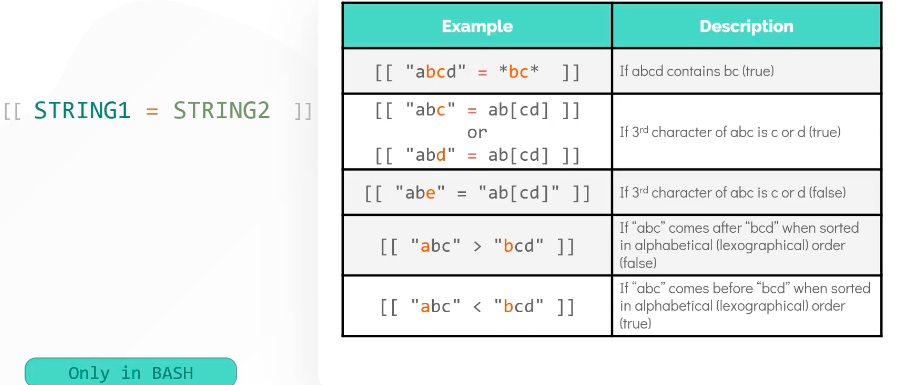
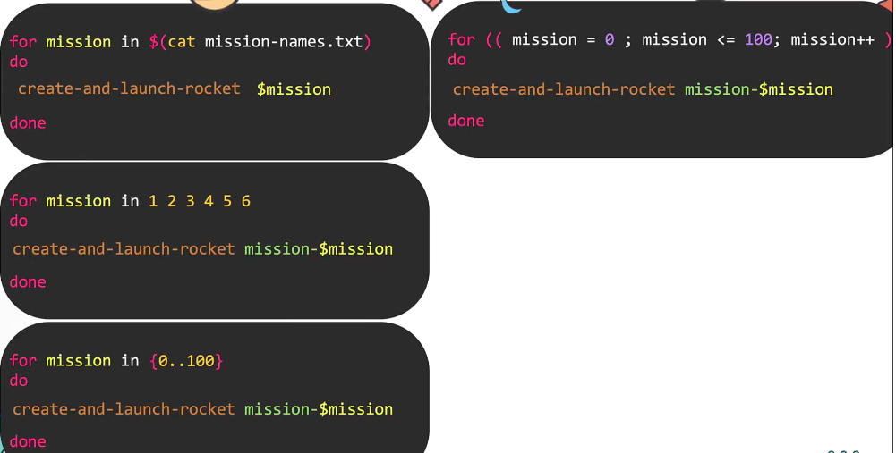
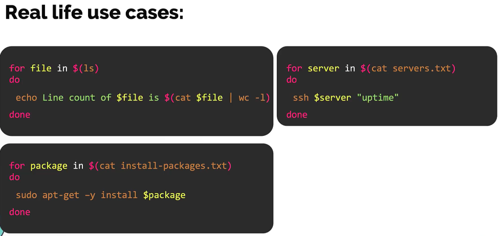

# SHELL BASICS
[More detailed notes of the course](https://github.com/kodekloudhub/shell-scripting-for-beginners-course)

## Run script as command
If you plan to run script as command then you need to do following three things -
1. __remove `.sh`__ extension e.g "create-and-launch-rocket" instead of "create-and-launch-rocket.sh"
> this is not mandatory but is best practice
2. add the path of the script to __`$PATH`__ variable e.g `export PATH=$PATH:/home/bob`
> this way the command can be run from location; to check location of command/script use `which <command>`
3. make the script __executable__ e.g `chmod +x /home/bob/create-and-launch-rocket`
-----
## Variables
- `some_variable=$(<command_with_stdout>)` store output of command to variable e.g var1=$(ls)
- naming convention best practice: use snake_case
### Concatenation
```bash
VAR1="Hello,"
VAR2=" World"
VAR3="$VAR1$VAR2"
echo "$VAR3"

VAR4="Hello, "
VAR5="${VAR4}World"  # variable and literal string together
echo "$VAR5"

VAR6="VALID"
VAR7="THIS IS $VAR6 variable" # variable and literal are separated by space
```
Output:
Hello, World
Hello, World
-----
## Command line arguments
- `$0`, `$1` and so on are special built-in arguments $0: holds script name while others holds arguments passed
-----
## Read inputs
- manual intervention to provide input
```bash
read -p "Enter mission name:" mission_name # -p: prompt message; mission_name: var name to store the input
echo $mission_name
```
> It's preferable to have command line arguments and not have manual intervention in a script but you can combine both and check if argument is not provided then you ask for it unless you have to use the script in CI/CD where you don't want manual intervention
-----
## Arithmetic operations
### `expr` command
```bash
expr 6 + 3  # correct
expr 6+3  # incorrect as no space
expr $A + $B  # add
expr $A /  $B  # divide
expr $A \* $B  # multiply; need escape character as '*' means everything in bash
```
### double paranthesis
- no space and no escape character needed
- prefixed with '$' symbol
```bash
echo $((A + B))  # you can give space for readability but not mandatory
C=$((A*B))
echo $((++A))  # pre-increment
echo $((A--))  # post-decrement
```

### bc (basic calculator)
- for floating point calculations
```bash
A=10
B=3
echo "$A / $B" | bc -l  # will print 3.3333
```
> Remember `$(()) vs $()`; one is for arithmetic operation and other for returning o/p of a command
-----
## Conditional logic
```bash
if <some_condition>
then
    echo "if true"
elif <some_condition>
then
    echo "elif true"
else
    echo "else true"
fi
```
- There are 2 ways of denoting conditional operators
    1. using `[ <some_condition> ]` works in all shell
    2. using `[[ <some_condition> ]]` works with bash and other advance shell (supports regex condition check)

    

    > Note: For string we use `=` and `!=` and not for numbers
    
    
    > As you can see, it supports regex comparison

```bash
[ COND1 ] && [ COND2 ]
[[ COND1 && COND2 ]]
[ COND1 ] || [COND2]
[[ COND1 || COND2 ]]
```
E.G
```bash
if [[ $A -gt 4 && $A -lt 10 ]]
then
    echo "if A is greater than 4 and less than 10"
elif [[ $A -gt 4 || $A -lt 10 ]]
then
    echo "if A is greater than 4 or less than 10"
fi
```

> For simple use case use (1) and for regex comparison and two or more conditional checks use (2)

> Use `-z $1` to check for command line argument first input
### File level operators
- `[ -e file ]` if file exists
- `[ -d file ]` if file exists and is directory
- `[ -s file ]` if file exists and has size greater than 0
- `[ -x file ]` if file is executable
- `[ -w file ]` if file is writeable
-----
## Loops
### For loop


> Here `{0..100}` is both inclusive and works on bash but not on bourne shell i.e 'sh'. But in most systems 'sh' points to 'bash'. To verify: `ls -l /bin/sh`; it will most likely point to `/bin/bash`



### While loop
- Use while loop when you have to:
    1. execute command until a specific condition is met
    2. infinite loop
    3. menu driven programs

e.g of (1)
```bash
rocket_status=...
while [ $rocket_status = "launching" ]
do
    sleep 2
    rocket_status=...
done
```
e.g of (2) and (3)
```bash
while true
do
    echo "1. Shutdown"
    echo "2. Restart"
    echo "3. Exit menu"
    read -p "Enter a choice: " choice
    if [ $choice eq 1 ]
    then
        shutdown now
    elif [ $choice eq 2 ]
    then
        shutdown -r now
    elif [ $choice eq 3 ]
    then
        break
    else
        continue
    fi
done
```
-----
## Case statement
- It is better than a lot of `if-elif` (more than 3)
- e.g of converting the above menu-driven script 

```bash
while true
do
    echo "1. Shutdown"
    echo "2. Restart"
    echo "3. Exit menu"
    read -p "Enter a choice: " choice
    
    case $choice in
        1) shutdown now  # in case of multiple commands use multiple lines
           ;;
        2) shutdown -r now
           ;;
        3) break
           ;;
        *) continue
           ;;
    esac
done
```
> Note the `)` after the choice options. Similarly a good practice is to put `;;` in the new line. `*` is similar to else condition.
-----
## Shebang
- Some syntax such as `{0..100}` is not supported by shells such as bourne shell or dash shell
- One option is to tell the users of your script to run using bash i.e `bash <your_script>`
- The best option is to use shebang to set the interpreter for the script to, for e.g, bash
- __This way even if the script is run by unsupported shells, it uses what is set by shebang e.g `#!/bin/bash`__
-----
## Exit codes
- `echo $?` to show the exit code of the last run command
- It's always a good idea to indicate the status of your script to the caller/user of the script
- 0 exit status means success; >0 exit status code is for failure
- `0` is the default exit code set by shell
- `exit <number>` to set exit code in a script
-----
## Function
- `return` keywork in function is not the same as in other programming language. Here we use return to mostly return the exit code from within a function
- But what if we need to return some value from a function
    1. either use `echo`
    2. or `return` which can only return numbers
e.g
```bash
function add(){
    echo $(( $1 + $2 ))  # use it as stdout
}
sum=$(add 1 2)
```
```bash
function add(){
    return $(( $1 + $2 ))  # use it as an exit code; only returns number and not text
}
add 1 2
sum=$?
```
> Consider functions as mini scripts
-----
## Best Practices
- Script should not be require to be edited before running
- Use command line arguments to pass inputs
- Don't use backticks i.e `` to execute a command instead use read friendly $()
- `;;` use double semi-colons in the new line in `case` statements
- Always start with a __shebang__ at the top of your script
- Always return appropriate exit codes in your script
- Use `shellcheck <script_name>` tool (needs installation) for linting if you're using vi or install plugin 'shellcheck' in vscode if you using IDE
- Use google shell style guide while writing the script - https://google.github.io/styleguide/shellguide.html

> `$()` vs `$(())` vs `[[  ]]`

-----
EXTRA:
- COLORED OUTPUT: https://misc.flogisoft.com/bash/tip_colors_and_formatting 