# Terraform Basics

## Types of IaC Tools


    1. Configuration Management Tools
        - Designed to install and manage softwares
        - Maintains standard structure on multiple servers at once
        - Version control e.g ansible playbook and role can be checked into version control repository
        - Idempotent (best feature): remembers the state
    
> Summary: You can install softwares, you can install softwares on many servers at once, you can verison controll the whole installation process and settings, install many times without worrying about errors and overrides as it is idempotent and remembers the state

    2. Server Templating Tools
        - Designed for creating __CUSTOM IMAGE__ for virtual machine or container
        - These images already contain all the softwares and dependencies on them thus eliminating the need for installing softwares after the images or containers are deployed
        - Examples of the images include custom AMIs on aws and docker images on docker hub and other cotainer registries
        - Unlike configuration management tools, server templating tools are __IMMUTABLE__ meaning once the image or containers are deployed they remain unchanged. If any change is to be made, we update the image and re-deploy the instance/container using the updated image

> Summary: Remember custom AMIs and docker images that have OS with pre-installed softwares and dependencies; any update will require re-deployment of image

    3. Provisioning Tools
        - Designed for deploying immutable infrastructure resources such as servers, db, network components
-----
## Intro
- Terraform is __DECLARATIVE__ meaning:
    - You declare the desired state and it'll _take care_ of __WHAT IS REQUIRED__ to go from __CURRENT STATE TO DESIRED STATE__
- Terraform uses 3 phases for achieving the desired state:
    1. `INIT` initialises the project and identifies the providers to be used for target environment
    2. `PLAN` drafts a plan to get to the desired/target state
    3. `APPLY` makes the necessary changes in the environment to bring it to the desired state
- Every object terraform manages is called __RESOURCE__
- Terraform __STATE__ is the blueprint of the infrastructure deployed by terraform
    
- Terraform can also manage other resources that were created manually or by other IaC tools using __TERRAFORM IMPORT__

-----
## HCL (HarshiCorp Configuration Language) Bascis
- HCL syntax follow the following structure
<a id="tf-syntax"></a>
```hcl
<block> <parameters> {
    key1 = value1
    key2 = value2
}
```
- We'll take a simple example of creating a file locally where terraform is installed
    - For this we'll create a terraform configuration file called, for e.g, local.tf
    
        - The first element is a `resource block`. We can have other types of block as well
        - Following that we have `resource type` which has fixed value. It gives us 2 bits of information - `provider` and `resource`
        - The final parameter for this resource block is the logical `resource name` used to identify that resource. It can be named anything
        - The keys are fixed/specific and depend on the `resource type` that we use. In case of "local_file" resource type, the only mandatory argument is `filename`

> `resource` block is one of the many blocks that we have in TF. It is also the only mandatory block that TF requires to deploy any resource

- A simple __terraform workflow__ consists of 4 simple steps:
    1. Write configuration file
    2. `terraform init` out of many things it checks and configures, one is to read the provider and download necessary plugins related to the provider to work on the resource declared in the .tf file in step 1
    3. `terraform plan` optional to check the execution plan that will be carried out
    4. `terraform apply`

- `terraform show` shows the current state of infrastructure as seen by terraform

> It is impossible to remember all types of providers and resource types and thus we can look at the terraforms comprehensive documentation to know the resource and their arguments

### Create, Update and Destroy of Resource
__Create File__
```hcl
resource "local_file" "pet" {
    filename = "/root/pets.txt"
    content = "We love pets!"
}
```
__Update File__
```hcl
resource "local_file" "pet" {
    filename = "/root/pets.txt"
    content = "We love pets!"
    file_permission = "0700"
}
```
- By default the file is created with 777 permission and thus in the above command we are updating it
- When we run `terraform plan`, it shows "-/+" before the resource syntax which implies that the resource will be deleted and then re-created
- Even though the change looks trivial, tf will delete the old file and create a new file with new changes and this type of infrastructure is called __immutable infrastructure__

__Destory File__

`terraform destroy`

-----
## Terraform Providers
- `terraform init` can be run multiple times; reads providers and downloads the plugins for the provider
- plugins are downloaded in `.terraform/plugins` in the working directory containing the config files i.e ".tf" files
- 3 types of providers:
    1. Official - by harshicorp
    2. Verified - by third party partners
    3. Community - run by community

-----
## Configuration Directory
- In TF, configuration directory is a directory that contains `.tf` files
- While we can give configuration file any name, following naming convention is used for best practices -
    1. __main.tf__: main config file containing resource definition
    2. __variables.tf__: contains variable declarations
    3. __outputs.tf__: contains outputs from resources
    4. __providers.tf__: contains provider definition

- Multiple providers can be used in a single configuration file. See example below -
```hcl
resource "local_file" "pets" {
    filename = "/root/pets.txt"
    content = "We love pets"
}

resource "random_pet" "my_pet" {  # random_pet is a resource type of provider random; check docs
    prefix = "Mrs"
    separator = "."
    length = 1
}
```
- In the above configuration file, the two providers are local and random
## <a id="variables"></a>Variables
- Just like main.tf file, variable file also consists of block and arguments
- variable name can be anything but a standard practice is to name it with the argument name for which we are using the variable

- A variable block can have 3 arguments: default, type and description
```hcl
variable "filename" {
    default = "/root/pets.txt"
    type = string
    description = "the path of the local file"
}
```
### <a id="variable-types"></a>Variable Types 
    - string
    - number
    - bool
    - any (default type)
    - list
    - set
    - tuple
    - map
    - object: collection of above types
- Example of number and bool
```hcl
variable "length" {
    default = 2
    type = number
    description = "length of the pet name"
}
variable "password_change" {
    default = true
    type = bool
}
```
- Example of list type

- To make it more restrictive, we can apply __type constraint__ as well


> Set is similar to list except that set can't have duplicates; default is list type 

> Tuple is similar to list except that list can only have elements of same type while tuple can have elements of multiple types e.g
```hcl
variable "kitty" {
    type = tuple([string, number, bool])
    default = ["cat", 7, true]
}
```

- Example of map type

- Similarly type constraint version of map would look like this:


- Example of object type

    

### <a id="pass-variables"></a>Ways of Using Variables
- We know that we can define default argument for a variable but that is optional. Other than defaul what are the other options?
    
    1. If we don't provide any value then terraform will prompt for the value used for `var.<variable_name>` in the `.tf` file in an interactive mode
    2. Command line flags - only makes sense if less variables to pass
    `terraform apply -var "filename=/root/pets.txt" -var "content=We love pets!"`
    3. Environment variables - with `TF_VAR_<variable_name>` syntax - makes sense if less variables
    ```bash
    export TF_VAR_filename="/root/pets.txt"
    export TF_VAR_content="We love pets!"

    terraform apply
    ```
    4. Variable definition files - when dealing with a lot of variables

    

    - This variable definition file can be named anything but should end with `.tfvars`, `.tfvars.json`
    - As you can see in the image above, if you name the variable definition file as `terraform.tfvars` or `terraform.tfvars.json` or `*.auto.tfvars` or `*.auto.tfvars.json` then the file will be detected and loaded automatically
    - But if not, for example, variables.tfvars then you need to provide it as command line flag `terraform apply -var-file variables.tfvars`

### Variable Definition Precedence
- If variable is defined in multiple ways, then terraform follows precedence to select the value

- <a id="variable-precedence"></a>Terraform loads variables in the following order, with later sources taking precedence over earlier ones:
    1. Environment variables
    2. The `terraform.tfvars` file, if present
    3. The `terraform.tfvars.json` file, if present
    4. Any `*.auto.tfvars` or `*.auto.tfvars.json` files, processed in lexical order of their filenames
    5. Any `-var` and `-var-file` options on the command line, in the order they are provided
- So, from the above image the file will be created with name best-pet.txt
-----
## <a id="reference-expression"></a>Reference Expression
- `<resource_type>.<resource_name>.<resource_attribute>`
- In production, it is command that the resources would be dependent on each other and thus could be the case that the output of one resource is input to another
- Below images shows example of using the attribute of `random_pet` in `local_file`
    <a id="resource-attribute-example"></a>
- If we check the documentation of `random_pet` resource type, we can see that it supports `id` resource attribute
- __Reference Interpolation:__ In syntax `${random_pet.my-pet.id}`, `${}` is used above for string interpolation i.e convert the result to string
-----
## <a id="resource-dependency"></a>Resource Dependency
- When you reference resource attribute of one resource into another resource like in the [above example](#resource-attribute-example), terraform automatically detects that `random_pet` should be created before `local_file` and similarly while deleting the resources it does it in opposite order i.e deletes `local_file` first and then `random_pet`. This is called __IMPLICIT DEPENDENCY__
- However, we can also create __EXPLICIT DEPENDENCY__ by using `depends_on` syntax. This is usually required when Resource A relies on another Resource B but doesn't access any of its attributes in its own arguments. We'll se the use-case of it in later section

    

> We use implicit dependency with __reference expressions__ and explicit dependency with __depends_on__
-----
## <a id="output-variables"></a>Output Variables
```
output "<variable_name>" {
    value = <variable_value>
    <arguments>
}
```
e.g
```hcl
resource "random_pet" "my-pet" {
    prefix = var.prefix
    separator = var.separator
    length = var.length
}

output pet-name {
    value = random_pet.my-pet.id
    description = "Record the value of pet ID generated by random_pet resource"
}
```
- output variables are shown when we run `terraform apply`
- `terraform output` shows all the output from all the files of the current configuration directory
- `terraform output pet-name` show a particular output value
- We know we can use reference expression to get the value of one resource as an input to another, we use output variable mainly for quickly displaying the value of provisioned resources on the screen
- It can also be used to feed values to other configuration tools such as shell scripts or ansible
-----
## <a id="tf-state"></a>Terraform State
- `terraform.tfstate` - single source of truth for what is deployed in the real world
- Each resource created by TF would have unique id which is used to identify the resource in real world
- It's terraform state that records the dependencies(implicit and explicit) b/w various resources and thus while deleting the resources it makes sure that the order is followed
- In a real world scenario when working with team, it's ideal to keep the latest state file in a remote so that all team members use use it for the latest info. Some examples of places for keeping the state file are -
    - AWS S3
    - Terraform Cloud
    - HashiCorp Consul
- But why not in git? 
    - We can store configuration files `.tf` files in git version control but it is not best practice to store state files in git. This is because state file may contain private info about resource such as private IP address, private dns and for DB it may also contain initial password in plain json format
    - To keep this private info safe we should consider the above mentioned platforms instead of git

### Terraform refresh

- From stackoverflow:
    - terraform refresh attempts to find any resources held in the state file and update with any drift that has happened in the provider outside of Terraform since it was last ran.

    - For example, lets say your state file contains 3 EC2 instances with instance ids of i-abc123, i-abc124, i-abc125 and then you delete i-abc124 outside of Terraform. After running terraform refresh, a plan would show that it needs to create the second instance while a destroy plan would show that it only needs to destroy the first and third instances (and not fail to destroy the missing second instance)

    - Terraform makes a very specific decision to not interfere with things that aren't being managed by Terraform. That means if the resource doesn't exist in its state file then it absolutely will not touch it in any way. This enables you to run Terraform alongside other tools as well as making manual changes in the AWS console. It also means that you can run Terraform in different contexts simply by providing a different state file to use, allowing you to split your infrastructure up into multiple state files and save yourself from catastrophic state file corruption.

- Any changes made to terraform outside it's control for e.g manual update, terraform refresh command will pick it up and update the state file
- This reconciliation will determine what action to take on the next `terraform plan/apply` command
- This command won't modify any infra resource but only the state file
- By default terraform performs refresh operation on every call to `terraform plan` and `terraform apply`. But we can explicity call `terraform refresh` to refresh the state as well which to be honest is really needed
- We can bypass refresh on plan/apply by using flag `-refresh=false`
-----
## <a id="tf-commands"></a>Terraform Commands
- `terraform init`, `terraform plan`, `terraform apply`
- `terraform validate` to validate the configuration file (sort of linting)
- `terraform fmt` formats the configuration file (sort of like black in python)
- `terraform show` shows the current state of infrastructure as seen by terraform
- `terraform providers` shows the providers used in the configuration directory
- `terraform output` and `terraform output <output_var_name>` to show the output values
- `terraform refresh` to sync terraform state file with the real world infrastructure
- `terraform graph` shows resources and their dependencies (needs tweak for sensible visualisation)

- In order to avoid show of all resources from state file and only choose a particular resource then we can use `terraform state show <resource_type.resource_name>`
-----
## <a id="lifecycle"></a>Lifecycle Rules

### 1. `create_before_destroy`
- By default, tf destroys the resource and then creates it in case of any update in the configuration file
- There might be a scenario when you wan't to create the resource first and then destroy the old one
- To do that we use `create_before_destroy` command e.g
```hcl
resource "local_file" "pet" {
    filename = "/root/pets.txt"
    content = "We love pets!"
    file_permission = 0700

    lifecycle {
        create_before_destroy = true  # new resource is created first before deleting old one
    }
}
```
### <a id="create-before-destroy-gotcha"></a>Why `create_before_destroy` doesn't always work?
- While the above example was just to show an example of the rule, it not always works in favor of you
- For example, if in the above case the file is created and then you update the configuration file with let's say a different file permission or text, and then run `terraform apply` again, what do you think will happen?
- Well you will see that the file does not exist anymore. This is because with `create_before_destroy` the file will be created or to be precise overwritten (meaning the same filename will be created and since the same file cannot be created again it will overwrite the old file) and then the same file will be destroyed
- This is because the __filename__ argument of `local_file` is not unique and thus we can't have 2 instances of the same file at the same time
### 2. `prevent_destroy`
- There might also be a case where we don't want to destory the resource for any reason
- To do that we can use `prevent_destroy` e.g
```hcl
resource "local_file" "pet" {
    filename = "/root/pets.txt"
    content = "We love pets!"
    file_permission = 0700

    lifecycle {
        prevent_destroy = true  # this will prevent resource from being deleted and will throw error
    }
}
```
- We use `prevent_destroy` for protecting important resources like db against accidental deletion
> Note: `terraform destroy` can override and thus delete the resource
- `prevent_destroy` only prevents deletion from __changes on configuration and subsequent apply__

### 3. `ignore_changes`
- Ignore any change made to a resource attribute (specific/all)
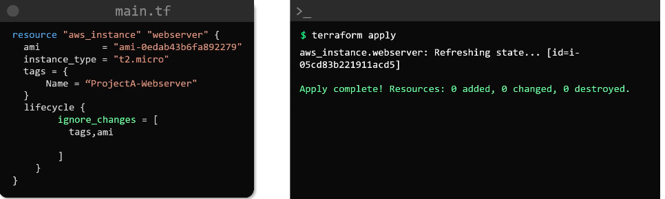
- In the above image, any change made to the tags or the ami attribute (you can also put `all` as an item) will be ignored
- Need to learn more about the use-case of it
-----
## <a id="data"></a>DataSources
- allows tf to read attributes of resources that were provisioned outside its control
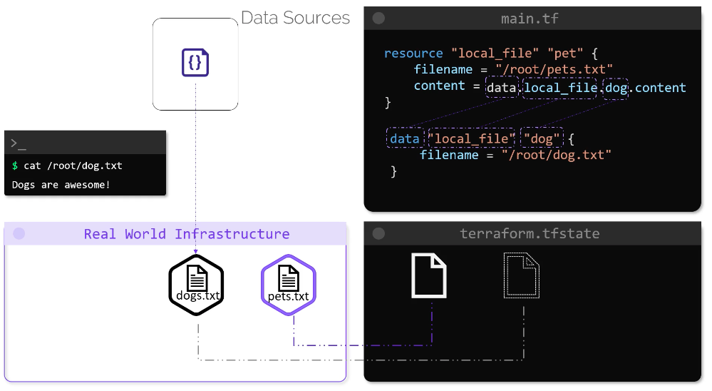
- The above image shows an example of text file called dog.txt which was created outside of tf using a shell script. Now, in order to read the content of that file we can create `data` block which is quite similar to `resource` block
- To use the above read data object we can use something like `data.local_file.<data_name>.<attribute>` details of which can be found in the documentation
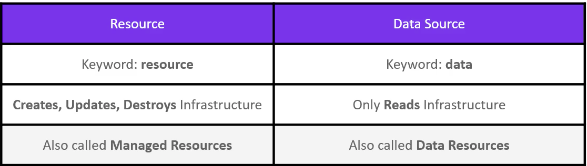

-----
## Meta Arguments
- Some already seen examples of meta arguments are - `depends_on` (for explicit dependency), `lifecycle` for lifecycle rule
- `count`
    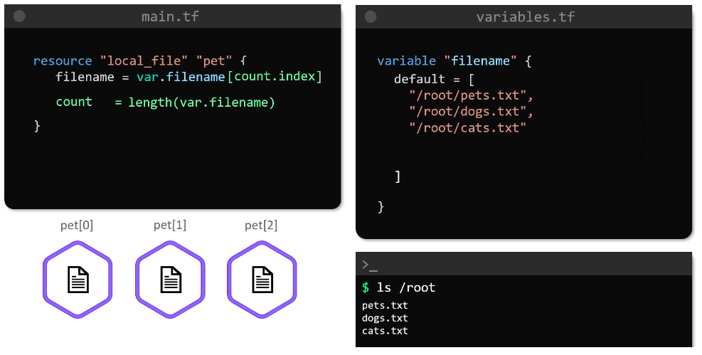
    - If we want to let's say create 3 files then we can use `count` meta-argument to repeat the block
    - `length` is an in-built function of tf
    ### Drawback of `count` while updating the block
    - However there is one significant drawback of `count` which is shown via image below
        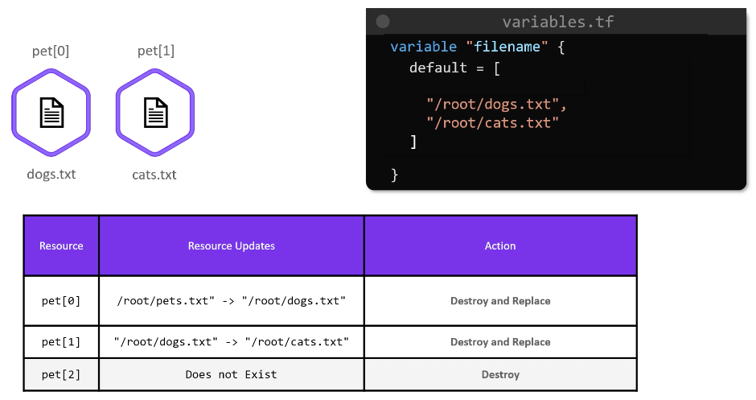
        - In the image, you can see that we have deleted the pets.txt file and when we run apply, tf does 2 replace and 1 destroy
        - This is because with count resources becomes list of resources and thus pet[0] as pets.txt, pet[1] as dogs.txt and pet[2] as cats.txt and now after the change it thinks pet[0] should be dogs.txt and pet[1] as cats.txt and thus replaces pet[0] and pet[1] resource name and destroys pet[2]
            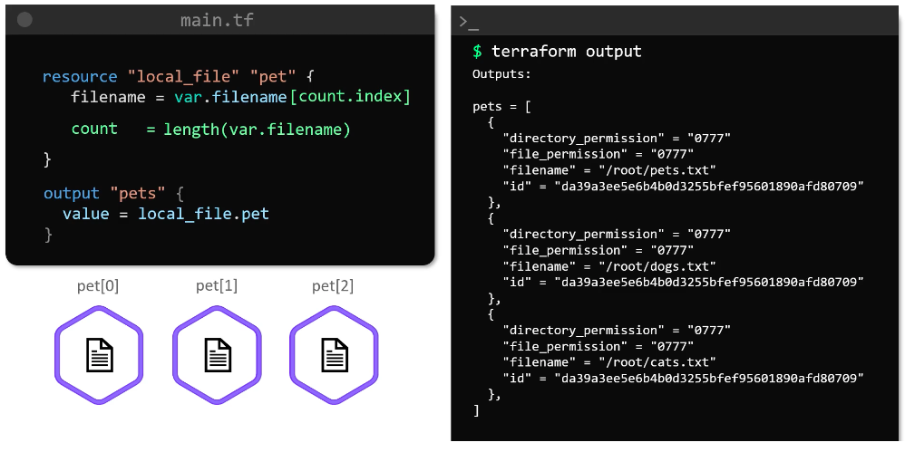
- <a id="for-each"></a>`for_each`
    - To fix the above drawback of count, we use `for_each` instead of `count`
    - `for_each` creates map of logical resources instead of list and thus when deleting/updating the resources tf lookups for the key rather than index
    > Note: `for_each` supports only `set` and `map` thus we have 2 options

    __Option 1: Set variables as `set` type in `variables.tf`__
    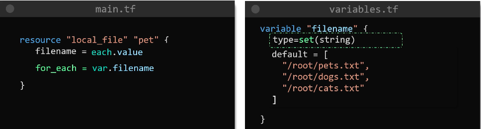
    
    __Option 2: Use in-built `toset` to type cast list to set in `main.tf`__
    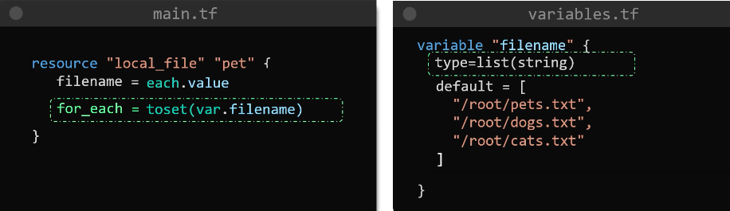

    - Now, when we delete any resource file, only that resource will be deleted as expected
    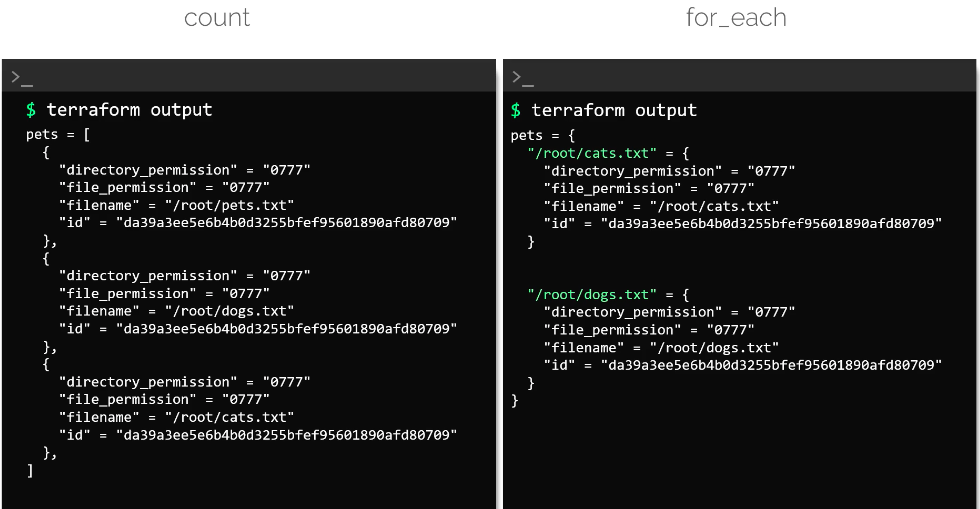

-----
## <a id="version"></a>Version Contraints
- When we run `terraform init` it downloads the latest plugins for the providers in the configuration file
- It could be the case that the new plugin update has deprecated some syntax in the configuration and thus we don't want to use that version of plugin for now. To do that we can use version constraint with `terraform` block as shown in image below - 
    

> Note: We can use terraform documentation on provider to check the versions and how to use verison contraint for the provider

- We can provide multiple providers under `required_providers` block
### Ways to provide version constraint
- `version = "1.4.0"`
- `version = "!= 2.0.0"`
- `version = "< 1.4.0"`
- `version = "> 1.2.0, < 2.0.0, != 1.4.0"`
- `version = "~> 1.2"` 1.2 or incremental addition of a version like 1.3, 1.4 and so on
- `version = "~> 1.2.0"` 1.2.0 or 1.2.1 and so on (mind that it won't check 1.3.* but only 1.2.*)

-----
## Terraform with AWS
### IAM
- User: individual access to AWS
- Group
    - collection of users
    - if we have to give same permission to 100 users, we can create group and attach that permission in form of policy to the group and add those users to that group. This way we don't need to attach same policy to those 100 users
    - if we need to later give any extra permission to some users of that group we can additionally attach permission in form of policy to those special users. This means users can have group policy as well as individual level attached policy
- Policy: used for granting permission for a resource/service to user/group/role
    - AWS Managed Policy
    - Custom Policy
- Role
    - we create role so that a resource/service such as EC2 can, let's say, read/write data on S3. A policy should be attached to role so that it can do stuff
        
        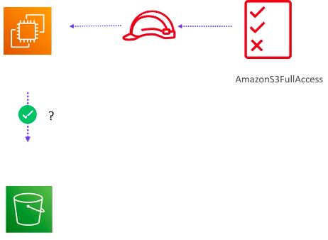
    - apart from one resource being able to perform certain actions on another resource on our behalf, role can also be assigned to below scenarios

        - providing access to IAM user belonging to another AWS account
        - providing access to applications interacting with services/resources on AWS
        - providing access to users managed outside of AWS
        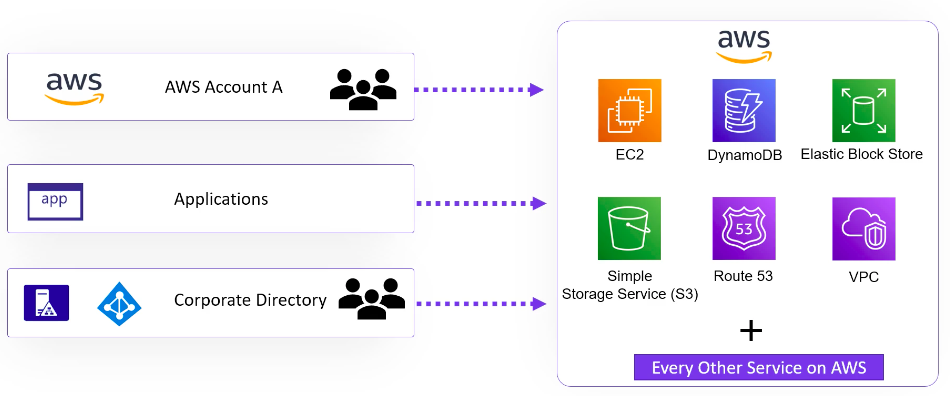

-----
### AWS Programmatic Access
- We need to download `aws cli` and install it
- After install, we need to configure it with `aws configure` command
- Below image shows the configuration and how to read the configured data
    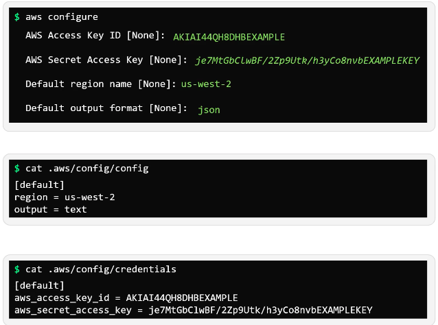

- CLI Syntax

    `aws <command> <sub-command> <options and parameters>` e.g `aws s3 create-user --user-name lucy`
- __ARN: Amazon Resource Name__ - unique identifier for resource in AWS
-----
### IAM with Terraform
```hcl
resource "aws_iam_user" "admin-user" {
    name = "lucy"  # mandatory field
    tags = {
        Description = "Technical Team Leader"
    }
}
```
- If we try to run terraform plan with this we might get 2 errors:
    1. region error: terraform expects region even for global resources such as IAM
    2. authentication to AWS error
- One easy option is to provide a provider block such as -
```hcl
provider "aws" {
    region = "us-west-2"
    access_key = "foo"
    secret_key = "bar"
}
```
- Providing secret key in version control is bad. Best practice is to either put access key in `.aws/credentials` folder or use env variable e.g `export AWS_ACCESS_KEY_ID=foo` etc.
- For region, we can keep the provider block or we can use environment variable for that as well
- Now that we have created the user, we can create policy and attach it to the user
- If you look at the terraform doc for `aws_iam_policy` you will find that the only mandatory field is policy which requires JSON document
- To provide JSON doc in our configuration file, the easiest way is to  make use of __HEREDOC SYNTAX__ which is commonly used in command line scripting languages such as bash scripts to provide multiline commands
- Heredoc syntax
    ```heredoc
        [COMMAND] <<DELIMITER
          line1
          line2
          ...
        DELIMITER
    ```
    > delimiter can be any string but commonly used is `EOF` which means end of file
- command in our case would be `policy` argument <a id="iam-tf"></a>

    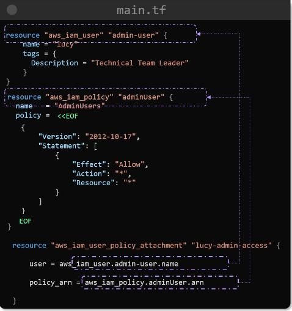
- Instead of `heredoc syntax` we can use `file` method to load the json file
    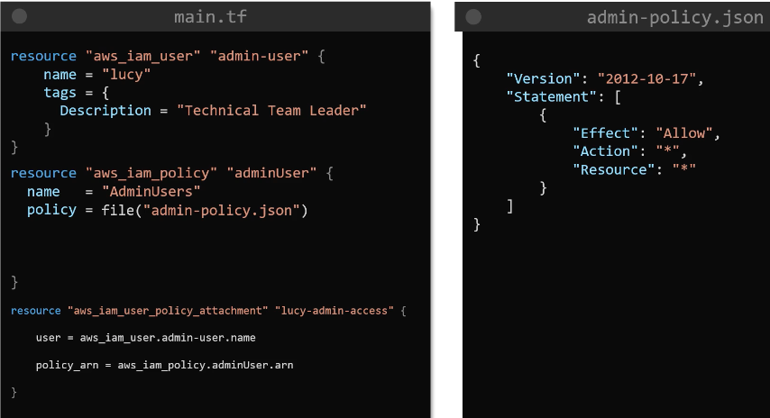
-----
### S3
- bucket name should be unique as aws creates a DNS name based on it, which can be accessed by anyone from anywhere
- initially, no one can access the bucket and it's objects, except the bucket owner
- access to s3 are governed by
    1. bucket policy: access at bucket level
    2. access control list: access/permission at an object level
-----
### S3 with Terraform
- 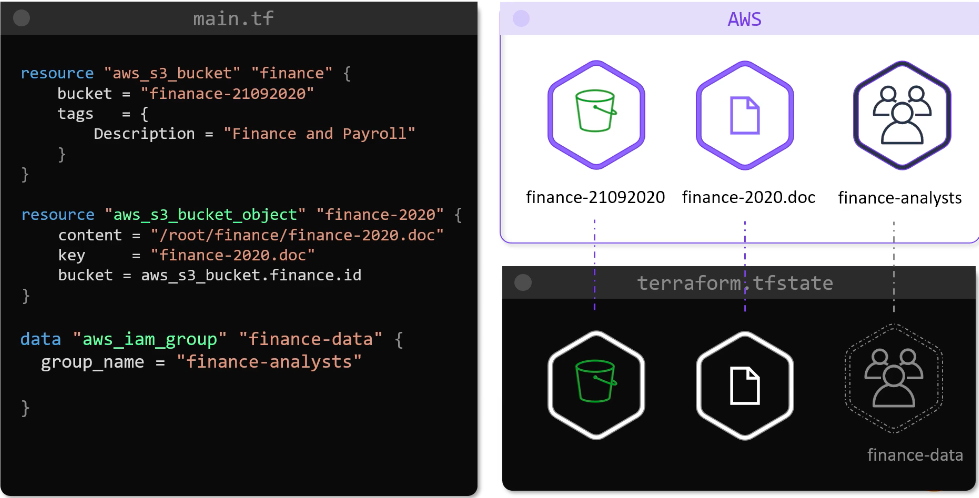
- In above image we have created s3 bucket and an object inside the bucket
- In the image, finance-analysts is the group that was created manually and now needs access to the bucket object
- In order to tell .tfstate which is the source of truth for tf about that manual resource we use `data` block
- Finally we can make use of bucket policy to allow group to access the bucket object
    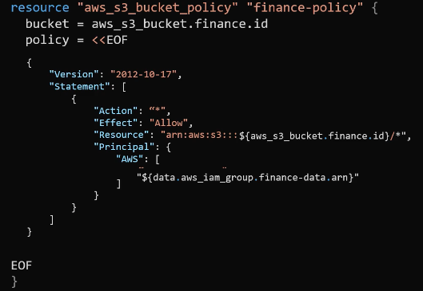

-----
## Remote State
- As we discussed earlier `.tfstate` is the only source of truth for terraform to know about real world infrastructure
- state file is generated locally when we run `terraform plan/apply`
- we learnt that storing state file in git version control is not ideal because:
    1. it contains sensitive information about the infrastructure/resources such as private ip, dns etc.
    2. git doesn't support state locking and thus if 2 developers operate on the state file at the same time it might lead to corruption of state file or other infrastructure issues
- services such as S3, terraform cloud and hashicorp consul provide state locking 
## <a id="remote-backend"></a>Remote Backend with S3
- Prerequisites
    1. __S3:__ to store .tfstate file
    2. __Dynamodb:__ for implementing state locking
    > S3 and Dynamodb resource has to be created to implement remote backend
- Now to create any resource e.g `local_file` we can either use terraform block in the main configuration file or create another config file `terraform.tf` and put terraform block there which is best practice as seen in the image below -
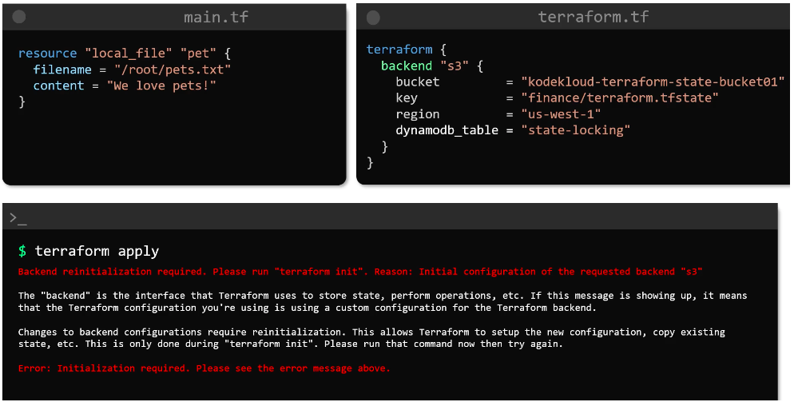
    > bucket, key(folder location) and dynamodb should already exist for the terraform backend block to work
- If you already have state file locally then after implementing remote backend shown in RHS of the image, if you run terraform apply it will throw error saying "reinitialization required"
- On running `terraform init` again will initialise new backend to be used and since we already have state file locally, it will give us option (yes/no) to copy it to remote backend
- `rm -rf terraform.tfstate`: we can now delete the local state file
- Running `terraform plan/apply` will lock the state file and pull it down from s3 bucket into memory and any subsequent changes to the state will be instantaneously uploaded to s3 and once the operation is complete the lock will be released
- state file will not be stored in the local configuration file anymore
```
Summary:
    1. create bucket, key and dynamodb
    2. create terraform backend block in a separate file
    3. `terraform init` to initialise with new backend state file instead of local storage
    4. `rm -rf terraform.tfstate` to remote local state file
    5. on running `terraform apply`, it will __lock__, __update__(if required) and __unlock__
```
-----


-----

-----
# SUMMARY
- [Terraform Syntax](#tf-syntax)
- [Input Variables](#variables)
    - [Variable Types](#variable-types)
    - [How to pass variables](#pass-variables)
    - [Variable Precedence](#variable-precedence)
- [Output Variables](#output-variables)
- [Reference Expression](#reference-expression)
- [Resource Dependency](#resource-dependency)
- [Terraform State](#tf-state)
- [Terraform Commands](#tf-commands)
- [Lifecycle Rules](#lifecycle)
    - [create-before-destroy-gotcha](#create-before-destroy-gotcha)
- [Data Block](#data)
- ["for_each" Meta Argument](#for-each)
- [Version Contraints](#version)
- [IAM in Terraform](#iam-tf)
- [Remote Backend](#remote-backend)
    - [state commands](#state-command)

- `terraform show`