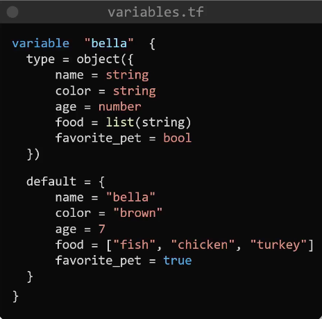

# Terraform Basics

## Types of IaC Tools


    1. Configuration Management Tools
        - Designed to install and manage softwares
        - Maintains standard structure on multiple servers at once
        - Version control e.g ansible playbook and role can be checked into version control repository
        - Idempotent (best feature): remembers the state
    
> Summary: You can install softwares, you can install softwares on many servers at once, you can verison controll the whole installation process and settings, install many times without worrying about errors and overrides as it is idempotent and remembers the state

    2. Server Templating Tools
        - Designed for creating __CUSTOM IMAGE__ for virtual machine or container
        - These images already contain all the softwares and dependencies on them thus eliminating the need for installing softwares after the images or containers are deployed
        - Examples of the images include custom AMIs on aws and docker images on docker hub and other cotainer registries
        - Unlike configuration management tools, server templating tools are __IMMUTABLE__ meaning once the image or containers are deployed they remain unchanged. If any change is to be made, we update the image and re-deploy the instance/container using the updated image

> Summary: Remember custom AMIs and docker images that have OS with pre-installed softwares and dependencies; any update will require re-deployment of image

    3. Provisioning Tools
        - Designed for deploying immutable infrastructure resources such as servers, db, network components
-----
## Intro
- Terraform is __DECLARATIVE__ meaning:
    - You declare the desired state and it'll _take care_ of __WHAT IS REQUIRED__ to go from __CURRENT STATE TO DESIRED STATE__
- Terraform uses 3 phases for achieving the desired state:
    1. `INIT` initialises the project and identifies the providers to be used for target environment
    2. `PLAN` drafts a plan to get to the desired/target state
    3. `APPLY` makes the necessary changes in the environment to bring it to the desired state
- Every object terraform manages is called __RESOURCE__
- Terraform __STATE__ is the blueprint of the infrastructure deployed by terraform
    
- Terraform can also manage other resources that were created manually or by other IaC tools using __TERRAFORM IMPORT__

-----
## HCL (HarshiCorp Configuration Language) Bascis
- HCL syntax follow the following structure
<a id="tf-syntax"></a>
```hcl
<block> <parameters> {
    key1 = value1
    key2 = value2
}
```
- We'll take a simple example of creating a file locally where terraform is installed
    - For this we'll create a terraform configuration file called, for e.g, local.tf
    
        - The first element is a `resource block`. We can have other types of block as well
        - Following that we have `resource type` which has fixed value. It gives us 2 bits of information - `provider` and `resource`
        - The final parameter for this resource block is the logical `resource name` used to identify that resource. It can be named anything
        - The keys are fixed/specific and depend on the `resource type` that we use. In case of "local_file" resource type, the only mandatory argument is `filename`

> `resource` block is one of the many blocks that we have in TF. It is also the only mandatory block that TF requires to deploy any resource

- A simple __terraform workflow__ consists of 4 simple steps:
    1. Write configuration file
    2. `terraform init` out of many things it checks and configures, one is to read the provider and download necessary plugins related to the provider to work on the resource declared in the .tf file in step 1
    3. `terraform plan` optional to check the execution plan that will be carried out
    4. `terraform apply`

- `terraform show` inspects the state file and shows the resource details

> It is impossible to remember all types of providers and resource types and thus we can look at the terraforms comprehensive documentation to know the resource and their arguments

### Create, Update and Destroy of Resource
__Create File__
```hcl
resource "local_file" "pet" {
    filename = "/root/pets.txt"
    content = "We love pets!"
}
```
__Update File__
```hcl
resource "local_file" "pet" {
    filename = "/root/pets.txt"
    content = "We love pets!"
    file_permission = "0700"
}
```
- By default the file is created with 777 permission and thus in the above command we are updating it
- When we run `terraform plan`, it shows "-/+" before the resource syntax which implies that the resource will be deleted and then re-created
- Even though the change looks trivial, tf will delete the old file and create a new file with new changes and this type of infrastructure is called __immutable infrastructure__

__Destory File__

`terraform destroy`

-----
## Terraform Providers
- `terraform init` can be run multiple times; reads providers and downloads the plugins for the provider
- plugins are downloaded in `.terraform/plugins` in the working directory containing the config files i.e ".tf" files
- 3 types of providers:
    1. Official - by harshicorp
    2. Verified - by third party partners
    3. Community - run by community

-----
## Configuration Directory
- In TF, configuration directory is a directory that contains `.tf` files
- While we can give configuration file any name, following naming convention is used for best practices -
    1. __main.tf__: main config file containing resource definition
    2. __variables.tf__: contains variable declarations
    3. __outputs.tf__: contains outputs from resources
    4. __providers.tf__: contains provider definition

- Multiple providers can be used in a single configuration file. See example below -
```hcl
resource "local_file" "pets" {
    filename = "/root/pets.txt"
    content = "We love pets"
}

resource "random_pet" "my_pet" {  # random_pet is a resource type of provider random; check docs
    prefix = "Mrs"
    separator = "."
    length = 1
}
```
- In the above configuration file, the two providers are local and random
## <a id="variables"></a>Variables
- Just like main.tf file, variable file also consists of block and arguments
- variable name can be anything but a standard practice is to name it with the argument name for which we are using the variable

- A variable block can have 3 arguments: default, type and description
```hcl
variable "filename" {
    default = "/root/pets.txt"
    type = string
    description = "the path of the local file"
}
```
### <a id="variable-types"></a>Variable Types 
    - string
    - number
    - bool
    - any (default type)
    - list
    - set
    - tuple
    - map
    - object: collection of above types
- Example of number and bool
```hcl
variable "length" {
    default = 2
    type = number
    description = "length of the pet name"
}
variable "password_change" {
    default = true
    type = bool
}
```
- Example of list type

- To make it more restrictive, we can apply __type constraint__ as well


> Set is similar to list except that set can't have duplicates

> Tuple is similar to list except that list can only have elements of same type while tuple can have elements of multiple types e.g
```hcl
variable "kitty" {
    type = tuple([string, number, bool])
    default = ["cat", 7, true]
}
```

- Example of map type

- Similarly type constraint version of map would look like this:


- Example of object type

    

### <a id="pass-variables"></a>Ways of Using Variables
- We know that we can define default argument for a variable but that is optional. Other than defaul what are the other options?
    
    1. If we don't provide any value then terraform will prompt for the value used for `var.<variable_name>` in the `.tf` file in an interactive mode
    2. Command line flags - only makes sense if less variables to pass
    `terraform apply -var "filename=/root/pets.txt" -var "content=We love pets!"`
    3. Environment variables - with `TF_VAR_<variable_name>` syntax - makes sense if less variables
    ```bash
    export TF_VAR_filename="/root/pets.txt"
    export TF_VAR_content="We love pets!"

    terraform apply
    ```
    4. Variable definition files - when dealing with a lot of variables

    

    - This variable definition file can be named anything but should end with `.tfvars`, `.tfvars.json`
    - As you can see in the image above, if you name the variable definition file as `terraform.tfvars` or `terraform.tfvars.json` or `*.auto.tfvars` or `*.auto.tfvars.json` then the file will be detected and loaded automatically
    - But if not, for example, variables.tfvars then you need to provide it as command line flag `terraform apply -var-file variables.tfvars`

### Variable Definition Precedence
- If variable is defined in multiple ways, then terraform follows precedence to select the value

- <a id="variable-precedence"></a>Terraform loads variables in the following order, with later sources taking precedence over earlier ones:
    1. Environment variables
    2. The `terraform.tfvars` file, if present
    3. The `terraform.tfvars.json` file, if present
    4. Any `*.auto.tfvars` or `*.auto.tfvars.json` files, processed in lexical order of their filenames
    5. Any `-var` and `-var-file` options on the command line, in the order they are provided
- So, from the above image the file will be created with name best-pet.txt
-----
## Resource Attribute
- `<resource_type>.<resource_name>.<resource_attribute>`
- In production, it is command that the resources would be dependent on each other and thus could be the case that the output of one resource is input to another
- Below images shows example of using the attribute of `random_pet` in `local_file`
    <a id="resource-attribute-example"></a>
- If we check the documentation of `random_pet` resource type, we can see that it supports `id` resource attribute
- <a id="resource-attribute"></a>In syntax `${random_pet.my-pet.id}`, `${}` is used above for string interpolation i.e convert the result to string
-----
## <a id="resource-dependency"></a>Resource Dependency
- When you reference resource attribute of one resource into another resource like in the [above example](#resource-attribute-example), terraform automatically detects that `random_pet` should be created before `local_file` and similarly while deleting the resources it does it in opposite order i.e deletes `local_file` first and then `random_pet`. This is called __IMPLICIT DEPENDENCY__
- However, we can also create __EXPLICIT DEPENDENCY__ by using `depends_on` syntax. This is usually required when Resource A relies on another Resource B but doesn't access any of its attributes in its own arguments. We'll se the use-case of it in later section

    

> We use implicit dependency with __reference expressions__ and explicit dependency with __depends_on__
-----
## <a id="output-variables"></a>Output Variables
```
output "<variable_name>" {
    value = <variable_value>
    <arguments>
}
```
e.g
```hcl
resource "random_pet" "my-pet" {
    prefix = var.prefix
    separator = var.separator
    length = var.length
}

output pet-name {
    value = random_pet.my-pet.id
    description = "Record the value of pet ID generated by random_pet resource"
}
```
- output variables are shown when we run `terraform apply`
- `terraform output` shows all the output from all the files of the current configuration directory
- `terraform output pet-name` show a particular output value
- We know we can use reference expression to get the value of one resource as an input to another, we use output variable mainly for quickly displaying the value of provisioned resources on the screen
- It can also be used to feed values to other configuration tools such as shell scripts or ansible
-----
## Terraform State
- `terraform.state` single source of truth for what is deployed in the real world
- Each resource created by TF would have unique id which is used to identify the resource in real world
- It's terraform state that records the dependencies(implicit and explicit) b/w various resources and thus while deleting the resources it makes sure that the order is followed
- In a real world scenario when working with team, it's ideal to keep the latest state file in a remote so that all team members use use it for the latest info. Some examples of places for keeping the state file are -
    - AWS S3
    - Terraform Cloud
    - HashiCorp Consul
- But why not in git? 
    - We can store configuration files `.tf` files in git version control but it is not best practice to store state files in git. This is because state file may contain private info about resource such as private IP address, private dns and for DB it may also contain initial password in plain json format
    - To keep this private info safe we should consider the above mentioned platforms instead of git

### Terraform refresh

- From stackoverflow:
    - terraform refresh attempts to find any resources held in the state file and update with any drift that has happened in the provider outside of Terraform since it was last ran.

    - For example, lets say your state file contains 3 EC2 instances with instance ids of i-abc123, i-abc124, i-abc125 and then you delete i-abc124 outside of Terraform. After running terraform refresh, a plan would show that it needs to create the second instance while a destroy plan would show that it only needs to destroy the first and third instances (and not fail to destroy the missing second instance).

    - Terraform makes a very specific decision to not interfere with things that aren't being managed by Terraform. That means if the resource doesn't exist in its state file then it absolutely will not touch it in any way. This enables you to run Terraform alongside other tools as well as making manual changes in the AWS console. It also means that you can run Terraform in different contexts simply by providing a different state file to use, allowing you to split your infrastructure up into multiple state files and save yourself from catastrophic state file corruption.

- By default terraform performs refresh operation on every call to `terraform plan` and `terraform apply`. But we can explicity call `terraform refresh` to refresh the state as well

-----
# SUMMARY
- [Terraform Syntax](#tf-syntax)
- [Input Variables](#variables)
    - [Variable Types](#variable-types)
    - [How to pass variables](#pass-variables)
    - [Variable Precedence](#variable-precedence)
- [Reference Expression](#resource-attribute)
- [Resource Dependency](#resource-dependency)
- [Output Variables](#output-variables)

- `terraform show`