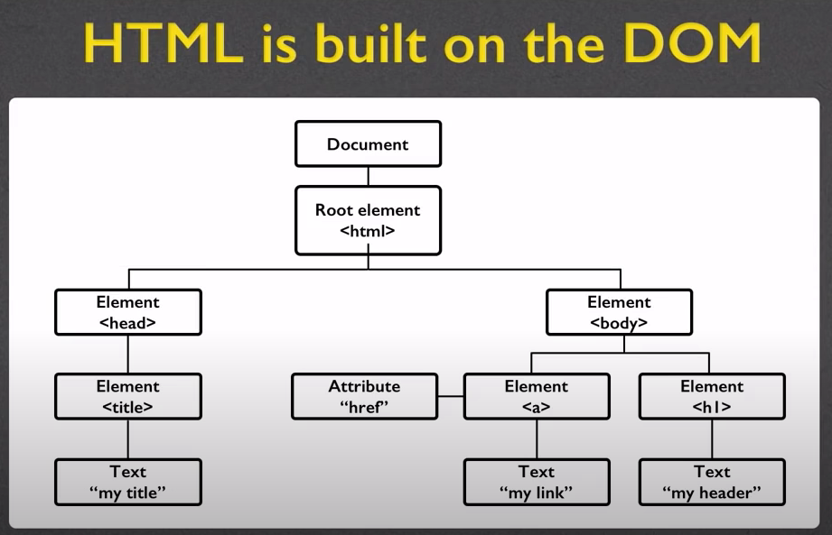
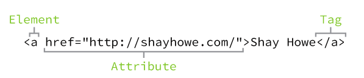
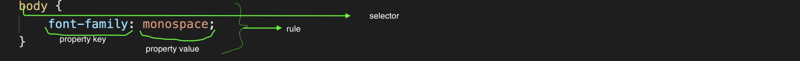
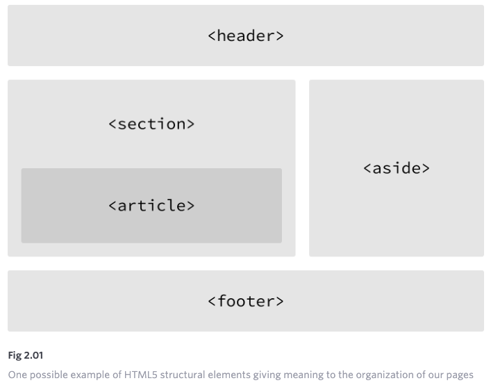
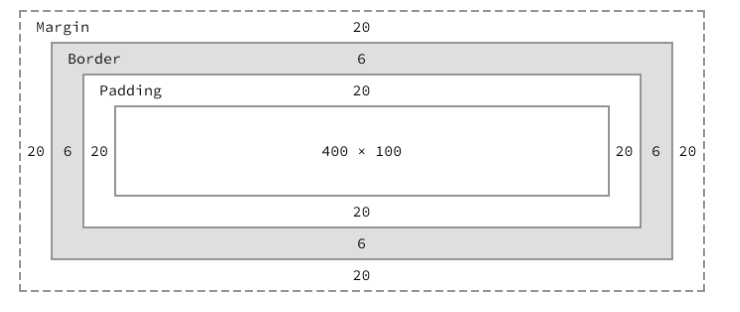

# DOM (Document Object Model)



---

- `<!DOCTYPE html>` indicates that the document contains HTML 5 code
- Writing CSS in HTML page is called _internal CSS_
- Having a separate CSS page is called _external CSS_
- Best practice is to have separate HTML and CSS
- Using an HTML file for your page content, a CSS file for styling, and a JavaScript file for interaction is called **separation of concerns**

- `<a>` `a` within `<>` is an example of an element
- `<a>...</a>` is an example of tag where `<a>` is an **opening tag** and `</a>` is **closing tag**
- Attributes: provide additional information about the element. Some commons ones include -
  - `id` _identifies_ an element
  - `class` _classifies_ an element
  - `src` provides _source_ for embedded content
  - `href` provides _hyperlink reference_ to linked resource



**Display**: - used for positioning elements. Most common types: 
  - _block_ (can't take width and height) 
    - block-level elements occupy any available width, regardless of their content, and begin on a new line.
    - block-level elements are generally used for larger pieces of content, such as headings and structural elements. 
  - _inline_
    - inline-level elements occupy only the width their content requires and line up on the same line, one after the other
    - inline-level elements are generally used for smaller pieces of content, such as a few words selected to be bold or italicized
  - _inline-block_
    - Using this value will allow an element to behave as a block-level element, accepting all box model properties (which we’ll cover soon). However, the element will be displayed in line with other elements, and it will not begin on a new line by default
  - _none_
    - this will completely hide an element and render the page as if that element doesn’t exist. Any elements nested within this element will also be hidden.

> Exactly how elements are displayed—as block-level elements, inline elements, or something else—is determined by the display property. Every element has a default display property value; however, as with all other property values, that value may be overwritten

```css
p {
  display: inline;
}
```

**Common Tags**

- Headings (block)
- Paragraphs (block)
  - Should only contain inline elements
- Divs (block)
  - Generic section that is larger than a paragraph
- `<br>` break
- Images (inline)

- As you learn tags, you learn their specific attributes. Some apply to any tag e.g

  - class: applies special properties to group of elements
  - id: specifies a unique id to one element on the page

- `<nav>` section of the page that links to other pages or to parts within the page
  - Often found in the `<header>` tag
- `<header>` tag is for introduction or navigational aids e.g title, navigation links etc.
  - not to be confused with `<head>` which holds title and metadata
- `` styling an image (using attributes like width and height) is an exception otherwise use separate CSS for other elements to style them

**Links**

- Absolute
  ```html
  <a href="https://www.facebook.com">Facebook</a>
  ```
  - link to a full URL
- Relative
  ```html
  <a href="page2.html">Second Page</a>
  ```
  - link to a local file in the same folder
  ```html
  <a href="docs/page2.html">Second Page</a>
  ```
  - link to a local file in a different folder called "docs"
- Internal/Embedded
  ```html
  <a href="#history">History section</a>
  ```
  - link to a different location in the same file (jump)

**Targets**

- meaning where to open when you click the link

* `_self`: default action (same tab)
* `_blank`: open in new tab or window

### HTML/CSS VALIDATORS

- HTML: https://validator.w3.org/
- CSS: https://jigsaw.w3.org/css-validator/

---

# CSS
### Why "Cascading"

- _Browser_ default: loads html and gives its default style
- _External_ style: loads style from external css file (where **specificity** matters)
- _Internal_ style: loads from the head section (for styling very specific file)
- _Inline_ style: inside an HTML element

---

### Rule precedence

- What if one selector is defined in two external files
  - rules from most recent file will have precedence
- What if one selector has more than one rule in the same file?
  - again latest will have precedence

> One way to override most recent precedence rule is by using `!important` attribute

```css
#food {
  background: green;
}
p {
  background: orange;
}
```
Here, id has more weight/specificity than type and thus `green` will be the value

> id then class then type (in precedence)

#### Combining Selectors
```html
<div class="hotdog">
  <p>...</p>
  <p>...</p>
  <p class="mustard">...</p>
</div>
```
```css
.hotdog p { /* specificity = 0(id) 1(class) 1(type) */
  background: brown;
}
.hotdog p.mustard { /* specificity = 0 2 1 (we have 2 class and 1 type selectors)*/
  background: yellow;
}
```
> When selectors are combined they should be read from right to left

> The best practice is to not prefix a class selector with a type selector. Generally we want to select any element with a given class, not just one type of element. And following this best practice, our new combined selector would be better as .hotdog .mustard.

> In general we want to always keep an eye on the specificity weights of our selectors.

---
### CSS syntax



**Selector**
  - designates which element or elements to target and apply styles to
  - generally targets an attribute value (e.g `id` or `class`) or element (e.g `<p>`)
  > Remember three different types of selectors: the `type`, `class`, and `id` selectors

  > Specificity: `id (1-0-0)`, `class (0-1-0)`, `type (0-0-1)`

---

### Referencing CSS

<link> element is used to define the relationship between the HTML file and the CSS file. Because we are linking to CSS, we use the `rel` attribute with a value of `stylesheet` to _specify their relationship_

---

### Divisions and Spans
- are elements (containers) that exist for styling purpose only
- `<div>` block-level element used for identifying large grouping of content
- `<span>` inline-level element used to identify smaller groupings of text within block-level element

---

### Organization of Pages


#### Header
- generally includes `heading`, `introductory text`, `navigation`

**`<header>` vs. `<head>` vs. `<h1>` through `<h6>` Elements**
```html
The <header> element is a structural element that outlines the heading of a segment of a page. It falls within the <body> element.

The <head> element is not displayed on a page and is used to outline metadata, including the document title, and links to external files. It falls directly within the <html> element.

Heading elements, <h1> through <h6>, are used to designate multiple levels of text headings throughout a page.
```

#### Article
- used to identify section of *independent*, self-contained content that may be independently distributed or reused
- When deciding to use it, if the content were removed from the context of the page and placed, for example, within an email, that content should still make sense

#### Section
- used to identify thematic grouping of content, generally (not always) includes heading
- used to break-up and provide hierarchy to a page

**Deciding Between `<article>`, `<section>`, or `<div>` Elements**
```html
Both the <article> and <section> elements contribute to a document’s structure and help to outline a document. If the content is being grouped solely for styling purposes and doesn’t provide value to the outline of a document, use the <div> element.
```

#### Encoding Special Characters
Each encoded character begins with `&` and ends with `;`. What falls b/w them is a character's
unique encoding, be it a name or numeric encoding. For example, we would encode the word `resumé` as `resum&eacute;`

---

### Layering Styles with Multiple Classes
Say we want all of our buttons to have a font size of 16 pixels, but we want the background color of our buttons to vary depending on where the buttons are used. We can create a few classes and layer them on an element as necessary to apply the desired styles
```html
<a class="btn btn-danger">...</a>
<a class="btn btn-save">...</a>
```
```css
.btn {
  font-size: 16px;
}
.btn-danger {
  background: red;
}
.btn-save {
  background: green;
}
```
---
### Length
#### Absolute length
**Pixel**

#### Relative length
**Percentage**: Percentage lengths are defined in relation to the length of another object. For example, to set the width of an element to 50%, we have to know the width of its parent element, the element it is nested within, and then identify 50% of the parent element’s width
```css
.col {
  width: 50%;
}
```

**em**: The em unit is represented by the em unit notation, and its length is calculated based on an element’s font size. So, for example, if an element has a font size of 14 pixels and a width set to 5em, the width would equal 70 pixels
```css
.banner {
  font-size: 14px;
  width: 5em;
}
```

> `pixels`, `percentages`, and `em` are the most popular units of measurement

---

### Box Model
```css
div {
  margin: 20px;
  border: 6px solid #949599;
  padding: 20px;
  width: 400px;
  height: 100px;
}
```


> We set a width property value of 400 pixels, but the actual width of our element is 492 pixels

#### Width
- Block-level elements have a default width of 100%, consuming the entire horizontal space available. 
- Inline and inline-block elements expand and contract horizontally to accommodate their content. 
  - Inline-level elements cannot have a fixed size, thus the width and height properties are only relevant to non-inline elements

> Please keep in mind that inline-level elements will not accept the width and height properties or any values tied to them

#### Margin
- Margins for an element fall outside of any border and are completely transparent in color. Margins can be used to keep all other elements a safe distance away.

> Generally speaking, the best `box-sizing` value to use is `border-box`. The border-box value makes our math much, much easier. If we want an element to be 400 pixels wide, it is, and it will remain 400 pixels wide no matter what padding or border values we add to it.

> One can use Developer tool to find out the breakdown of the box model for our selected element by selecting the “Computed” tab

---
### Positioning with float
- `float` property allows us to take an element, remove it from the normal flow of a page, and position it to the left or right of its parent element. All other elements on the page will then flow around the floated element. An `` element floated to the side of a few paragraphs of text, for example, will allow the paragraphs to wrap around the image as necessary

> **The `float` property relies on an element having a display value of `block`**, and may alter an element’s default `display` value if it is not already displayed as a block-level element.
For example, an element with a display value of inline, such as the `<span>` inline-level element, ignores any height or width property values. However, should that inline-level element be floated, its display value will be changed to block, and it may then accept height or width property values.

---
### Positioning with inline-block
- The `inline-block` method is primarily helpful for laying out pages or for placing elements next to one another within a line
- Using `inline-block` elements allows us to take full advantage of the box model without having to worry about clearing any floats
- One of the easiest way to remove the white space between inline-block elements is to open an HTML comment directly after an inline-block element’s closing tag. Then, close the HTML com- ment immediately before the next inline-block element’s opening tag. E.g
```html
<header>...</header>
<section>
  ...
</section><!--
--><section>
  ...
</section><!--
--><section>
  ...
 </section>
 <footer>...</footer>
```
---
## Typography

### Typeface

- A `font` is a file that contains a `typeface`. Using a font on a computer allows the computer to access the typeface.

*font-family*

*font-size*

*font-style* (e.g italic, normal)

*font-variant* (normal, inherit, small-caps)

*font-weight* (bold, normal, or 100-900)

*line-height*:  It sets the differences between two lines of your content. The best practice for legibility is to set the line-height to around one and a half times our font-size property value. This could be quickly accomplished by setting the line-height to 150%, or just 1.5. However, if we’re working with a baseline grid, having a little more control over our line-height using pixels may be preferable.

**Shorthand Font Properties**
- order from left to right: `font-style, font-variant, font-weight, font-size, line-height, and font-family`
- A forward slash, `/`, separator is needed between the font-size and line-height property values
- When using this shorthand value, every property value is optional except the font-size and font-family property values
**CSS Pseudo Classes**
- pseudo-classes are keywords that may be added to the end of a selector (e.g `a:hover`) to style an element when it’s in a unique state

### Text Properties

*text-align* (left, right, center, justify, inherit)
> The text-align values left and right will align text within an element to the left or right, whereas the float values left and right will move the entire element.

*text-decoration* (none, underline, overline, line-through, inherit)

*text-indent* can be used to indent the first line of text within an element. Positive values will indent text inward, while negative values will indent text outward

*text-shadow*

*text-transform* (none, capitalize, uppercase, lowercase, inherit)

*letter-spacing*

*word-spacing*

---

## Setting Background

`background-repeat`
- By default, a background image will repeat indefinitely, both vertically and horizontally, unless otherwise specified
- The background-repeat property accepts four different values: `repeat, repeat-x` (repeat horizontally), `repeat-y`, and `no-repeat`

**background shorthand**
`background-color, background-image, background-position, and background-repeat` e.g
```css
div {
  background: #b2b2b2 url("alert.png") 20px 10px no-repeat;
}
```

**fallback**
```css
div {
  background-color: #b2b2b2;
  background-color: rgba(0, 0, 0, .3);
}
```
- Here, if a browser understands the RGBa or HSLa value it will render it, and if it doesn’t, it will fall back to the hexadecimal value above it.

---

## Image

**Positioning Image**
- the float property was originally intended to position images to the left or right of a containing element

**When to Use an Image Element vs. a Background Image**
> The `` element within HTML is the preferred option when the image being used holds semantic value and its content is relevant to the content of the page.

> The `background` or `background-image` property within CSS is the preferred option when the image being used is part of the design or user interface of the page. As such, it’s not directly relevant to the content of the page.

---
## Building Forms

**Initialisation**
```html
<form action="/login" method="post">
  ...
</form>
```
`action` attribute contains the URL to which information included within the form will be sent for processing by the server. The `method` attribute is the HTTP method browsers should use to submit the form data.

**Text field**
```html
<input type="text" name="username">
```
`name` attribute value is used as the name of the control and is submitted along with the input data to the server

**Text area**
```html
<textarea name="comment">Add your comment here</textarea>
```

### Organizing Form Elements

**Label** 
- may include a `for` attribute. The value of the `for` attribute should be the same as the value of the `id` attribute on the form control the label corresponds to. Matching up the `for` and `id` attribute values ties the two elements together, allowing users to click on the `<label>` element to bring focus to the proper form control
```html
<label for="username">Username</label>
<input type="text" name="username" id="username">
```

> If desired, the `<label>` element may wrap form controls, such as radio buttons or check boxes. Doing so allows omission of the for and id attributes. e.g

```html
<label>
  Username
  <input type="text" name="username">
</label>
```

**fieldset** acts like a section for better organization

---

## Table

**Border Collapse**
determines a table’s border model. There are three values for the border-collapse property: `collapse, separate, and inherit`. By default, the border-collapse property value is `separate`, meaning that all of the different borders will stack up next to one another. The `collapse` value, on the other hand, condenses the borders into one, choosing the table cell as the primary border.


---
### Custom CSS properties
- They are set using custom property notation (e.g., `--main-color: black;`) and are accessed using the var() function (e.g., `color: var(--main-color);`).
---
### Comments
> HTML comments start with `<!-- and end with -->`. CSS comments start with `/*` and end with `*/`

---

## Additional summary
- Things important for positioning: `float` (remember to contain the flow), display e.g `inline-block` (remember to remove space in inline-block) and `box model properties` (including `padding`, `border` and `margin`)
- for better use-case of padding, border and margin check speaker-info selector (styles_conference -> assets -> stylesheets -> main.css)

---

## Must revisit rules

- The `float` property relies on an element having a display value of `block`, and may alter an element’s default display value if it is not already displayed as a block-level element. As we float elements we must keep an eye on how their display property values are affected
- It is important that the `clear` be applied to an element appearing after the floated elements, not before, to return the page to its normal flow.
- As elements are floated, it is important to keep note of how they affect the flow of a page and to make sure the flow of a page is reset by either clearing or containing the floats as necessary. Failing to keep track of floats can cause quite a few headaches, especially as pages begin to have multiple rows of multiple columns.
- Remember, because inline-block elements are displayed on the same line as one another, they include a single space between them. And in order to display all of the `<section>` elements on the same row, the white space between each `<section>` element must be removed
- Understand the difference b/w `span, div, section, article`

---
## Best Practices CSS
- organize code with comments
- always try to use names based on content/semantic and not based on style e.g
```css
/* Bad Code */
.red-box {...}
/* Good Code */
.alert-message {...}
```
- CSS selectors can easily become too long and too location specific. The longer a selector is and the more prequalifiers it includes, the higher specificity it will contain. And the higher the specificity the more likely a selector is to break the CSS cascade. 
> Use IDs sparingly
```css
/* Bad Code */
#aside #featured ul.news li a { ... }
#aside #featured ul.news li a em.special { ... }

/* Good Code */
.news a { ... }
.news .special { ... }
```

- Use shorthand properties and values
```css
/* Bad Code */
img {
  margin-top: 5px;
  margin-right: 10px;
  margin-bottom: 5px;
  margin-left: 10px;
}
button {
  padding: 0 0 0 20px;
}

/* Good Code */
img {
  margin: 5px 10px;
}
button {
  padding-left: 20px;
}
```
- Drop units from zero values
```css
/* Bad Code */
div {
  margin: 20px 0px;
  letter-spacing: 0%;
  padding: 0px 5px;
}
/* Good Code */
div {
  margin: 20px 0;
  letter-spacing: 0;
  padding: 0 5px;
}
```


---
# JavaScript

- The `<script>` element could be placed in the `<head>` or elsewhere in the `<body>`. However, putting `<script>` element at the end of the `<body>` section enables all the page content to display on the screen first, and then load the script
- Adding the <noscript> element is an example of fault tolerance or graceful degradation. By using the <noscript> element, your code can detect and plan for when a feature isn't supported or available

- Scripting languages (javascript) use the DOM to interact with the document

**DOM objects/elements**

- document - root of the page
  document.URI, document.height etc.
- element - node in the tree
- nodeList - array of elements
  document.getElementByTagName('p') would return set of nodes
- attribute - rarely used (node in the DOM)
